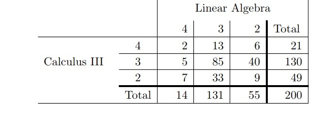
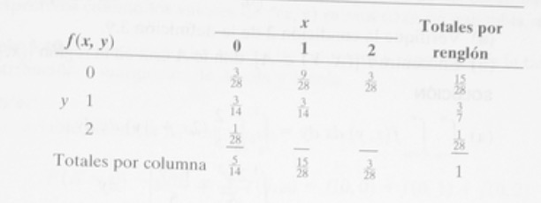

# Distribuciones de probabilidad multivariada


## Distribión conjunta de dos variables aleatorias
Nuestro estudio de variables aleatorias y sus distribuciones de probabilidad en las secciones anteriores se restringen al espacio muestral unidimensional, en los que registramos los resultados de un experimento como los valores que toma una sola variable aleatoria. Habrá situaciones, sin embargo, donde podemos encontrar que es deseable registrar los resultados simultáneos de diversas variables aleatorias. Por ejemplo, podemos medir el tiempo de ensamblaje de un automobil **T** y el número de trabajadores **N** de un taller mecanico, que dan lugar a un espacio muestral bidimensional que consiste en los resultados $(t,n)$.  de 

### Distribución de probabilidad conjunta para variables aleatorias discretas

Si $X$ y $Y$ son dos variables aleatorias discretas, la distribución de probabilidad para sus ocurrencias simultáneas se puede representar mediante una función con valores $f(x,y)$ para cualquier par de valores $(x,y)$ dentro del rango de valores de $X$ y $Y$.

**Definición**. La función $f(x,y)$ es una **distribución de probabilidad conjunta** o **función de masa de probabilidad** de las variables aleatorias discretas $X$ y $Y$ si

1. $f(x,y)	\geq 0$ para toda $(x,y)$,

2. $\sum_{x}\sum_{y}f(x,y) = 1$,

3. $P(X = x, Y = y) = f(x,y)$.

Para cualquier región $A$ en el palno $xy$, $P[(X,Y)] \in A = \sum\sum_{A}f(x,y)$.


**Ejemplo**. Para graduarse con un pregrado en matemáticas, todos los estudiantes deberían pasar Calculo III y Álgebra Lineal con una nota igual o superior a $3$. La notas de los estudiantes de matemáticas se encuentran en la siguiente tabla.


```{r pressure, echo=FALSE, fig.cap="Notas Álgebra lineal y Calculo III", out.width = '90%'}

```


a. ¿Cuál es la probabilidad de obtener una calificación igual o superior a 3 en Álgebra Lineal?

b. ¿¿Cuál es la probabilidad de obtener una calificación igual o superior a 3 en Calculo III?

c. ¿Cuál es la probabilidad de obtener una calificación igual o superior a 3 tanto en Álgebra Lineal como en Calculo III?


**Solución**

a. Sea $X$ y $Y$ variables aleatorias que representan la nota obtenida (en una escala de 4) por los estudiantes de Calculo III y Álgebra lineal, respectivamente, de una población de 200 estudiantes. Si *A* representa el par ordenado de la notas de Calculo III y Álgebra lineal tales que la nota en Álgebra lineal es igual o mayor a $3$, entonces la probabilidad de obtener una nota igual o superior a $3$ en Álgebra lineal es escrita:

\begin{equation}
\mathbb{P}[(X,Y), \in A] = \sum_{(x,y) \in A}\sum pX,Y(x,y) = \frac{2+5+7+13+85+33}{200} = \frac{145}{200}.  \nonumber
\end{equation}

b. Sea $X$ y $Y$ variables aleatorias que representan la nota obtenida (en una escala de 4) por los estudiantes de Calculo III y Álgebra lineal, respectivamente, de una población de 200 estudiantes. Si *A* representa el par ordenado de la notas de Calculo III y Álgebra lineal tales que la nota en Álgebra lineal es igual o mayor a $3$, entonces la probabilidad de obtener una nota igual o superior a $3$ en Calculo III es escrita:

\begin{equation}
\mathbb{P}[(X,Y), \in A] = \sum_{(x,y) \in A}\sum pX,Y(x,y) = \frac{2+13+6+5+85+40}{200} = \frac{151}{200}.  \nonumber
\end{equation}

c. Sea $X$ y $Y$ variables aleatorias que representan la nota obtenida (en una escala de 4) por los estudiantes de Calculo III y Álgebra lineal, respectivamente, de una población de 200 estudiantes. Si *A* representa el par ordenado de la notas de Calculo III y Álgebra lineal tales que la nota en Álgebra lineal es igual o mayor a $3$, entonces la probabilidad de obtener una nota igual o superior a $3$ tanto en Calculo III como en Álgebra lineal es escrita:

\begin{equation}
\mathbb{P}[(X,Y), \in A] = \sum_{(x,y) \in A}\sum pX,Y(x,y) = \frac{2+5+13+85}{200} = \frac{105}{200}.  \nonumber
\end{equation}

Para cualquier variable aleatoria $X$ y $Y$, el cdf conjunta se define como:

\begin{equation}
F_{X,Y}(x,y) = \mathbb{P}(X \leq x, Y \leq y),  \nonumber
\end{equation}

mientras la pdf marginal de $X$ y $Y$ , denotadas por $p_{X}(x)$ y $p_{Y}(y)$ se definen como:

\begin{equation}
p_{X}(x) = \sum_{y} p_{X,Y}(x,y)  \nonumber
\end{equation}

\begin{equation}
p_{Y}(y) = \sum_{y} p_{X,Y}(x,y).  \nonumber
\end{equation}


### Distribución de probabilidad conjunta para variables aleatorias continuas

Cuando $X$ y $Y$ son variables aleatorias continuas, la **función de densidad conjunta** $f(x,y)$ es una superficie sobre el plano $xy$, y $\mathbb{P}[(X,Y) \in A]$, donde $A$ es cualquier región en $xy$.

**Definición**. La función $f(x,y)$ es una **función de densidad conjunta** de las variables aleatorias $X$ y $Y$ si

1. $f(x,y)	\geq 0$ para toda $(x,y)$,

2. $\int^{\infty}_{-\infty}\int^{\infty}_{-\infty}f(x,y) dxdy= 1$,

3. $\mathbb{P}[(X,Y) \in A] = \int_{A}\int f(x,y) dxdy$.

Para una variable aleatoria $X$ y $Y$, la cdf conjunta se define:

\begin{equation}
F_{X,Y}(x,y) = \int^{x}_{-\infty}\int^{y}_{-\infty}f(x,y)dxdy, -\infty < x < \infty, -\infty < y < \infty,   \nonumber
\end{equation}

mientras la pdf marginal de $X$ y $Y$, denotadas por $f_{X}(x)$ y $f_{Y}(y)$, respectivamente se definen:

\begin{equation}
f_{X}(x) = \int^{\infty}_{-\infty}f_{X,Y}(x,y)dy, -\infty < x < \infty, -\infty < y < \infty,   \nonumber
\end{equation}

\begin{equation}
f_{Y}(y) = \int^{\infty}_{-\infty}f_{X,Y}(x,y)dx, -\infty < y < \infty, -\infty < y < \infty,   \nonumber
\end{equation}

 
**Ejemplo**. Dada la siguiente función de probabilidad conjunta (pdf) para variables aleatorias continuas

\begin{equation} 
f_{X,Y}(x,y) = \left \{ \begin{matrix} 1 & \mbox{si}1 \quad si \quad 0 \leq x \leq 1, 0 \leq y \leq 1, \\ 0 & \mbox{en otros casos.}\end{matrix}\right. \nonumber
\end{equation}

a. Encontrar $F_{X,Y}(x=0.6, y= 0.8)$.
b. Encontrar $\mathbb{P}(0.25 \leq X \leq 0.75, 0.1 \leq Y \leq 0.9)$.
c. Encontrar $f_{X}(x)$.

**Solución**.

a. 
\begin{equation} 
F_{X,Y}(x=0.6, y= 0.8) =  \int^{0.6}_{0}\int^{0.8}_{0}f_{X,Y}(x,y) dxdy = \int^{0.6}_{0}\int^{0.8}_{0}1 dxdy = \int^{0.6}_{0} 0.8 dy = 0.48.  \nonumber
\end{equation}

b. 
\begin{equation} 
\mathbb{P}(0.25 \leq X \leq 0.75, 0.1 \leq Y \leq 0.9) = \int^{0.75}_{0.25}\int^{0.9}_{0.1}f_{X,Y}(x,y) dxdy = \int^{0.75}_{0.25}\int^{0.9}_{0.1} 1 dxdy = \int^{0.75}_{0.25}0.8dy = 0.40.    \nonumber
\end{equation}

c. 
\begin{equation} 
f_{X}(x) = \int^{1}_{0}f_{X,Y}(x,y) dy = 1, \quad 0 \leq x \leq 1    \nonumber
\end{equation}


### Distribución condicional de probabilidad e independencia estadística

**Definición**. Sean $X$ y $Y$ dos variables aleatorias, discretas o continuas. La **distribución condicional**  de la variable aleatoria Y, dado que $X=x$, es 
\begin{equation} 
f(x|y) = \frac{f(x,y)}{g(x)}, \quad g(x)>0.   \nonumber
\end{equation}

De manera similar se define la distribución condicional de $X$, dado que $Y = y$, como:

\begin{equation} 
f(y|x) = \frac{f(x,y)}{h(y)}, \quad h(y)>0.   \nonumber
\end{equation}

Si se desea encontrar la probabilidad de que la variable aleatoria discreta $X$ se encuentra entre $a$ y $b$ cuando se sabe que la variable aleatoria discreta $Y = y$, evaluamos

\begin{equation} 
P(a < X < b | Y = y) = \sum_{x}f(x|y),   \nonumber
\end{equation}

donde la sumatoria se extiende a todos los valores de $X$ entre $a$ y $b$. Cuando $X$ y $Y$ son continuas, se tiene

\begin{equation} 
P(a < X < b | Y = y) = \int^{b}_{a}f(x|y)dx.   \nonumber
\end{equation}


**Ejemplo**. Se selecciona al azar dos repuestos para un automóvil de una caja que contiene tres repuestos azules, dos rojos y 3 verdes. Si $X$ es el número de repuestos azules y $Y$ es el número de repuestos rojos que se seleccionan, encontrar:


a. La función de probabilidad conjunta $f(x,y)$.

b. $\mathbb{P}[X,Y] \in A$, donde $A = {(x,y)| x+y \leq 1}$.

c. Encontrar la distribución condicional de $X$, dado que $Y=1$, y utilícela para determinar $\mathbb{P}(X = 0 | Y = 1)$.

**Solución**.

```{r pressure2, echo=FALSE, fig.cap="Distribución de probabilidad conjunta", out.width = '80%'}

```

a. Los posibles pares de valores $(x,y)$ son $(0,0),(0,1),(1,0),(1,1),(0,2),$ y $(2,0)$. Ahora bien, $(0,1)$, por ejemplo, representa la probabilidad de que se seleccionen un repuesto rojo y uno verde. El número total de formas igualmente probables de seleccionar cualesquiera dos repuestos de los ocho es $\binom{8}{2}=28$. El número de formas de seleccionar uno rojo de dos repuestos rojos y uno verde es $\binom{2}{1}\binom{3}{1}=6$. De aquí $f(0,1)=6/28=3/14$. Calculos similares dan las probabilidades para los otros casos,  que se encuentran en la tabla de abajo. Notese que las probabilidades suman 1.

\begin{equation} 
f(x,y) = \frac{\binom{3}{x}\binom{2}{y}\binom{3}{2-x-y}}{\binom{8}{2}},  \nonumber
\end{equation}

para $x=0,1,2; \quad y = 0,1,2; \quad 0 \leq x+y \leq 2$.

b. 
\begin{equation} 
\begin{split}
f(x,y) = \mathbb{P}[(X,Y) \in A] & =  P(X+Y \leq 1)  \\ 
& = f(0,0) + f(0,1) + f(1,0) \\
& = \frac{3}{28} + \frac{3}{14} + \frac{9}{28} \\
& = \frac{9}{14}. \nonumber
\end{split}
\end{equation}

c. Necesitamos encontrar $f(x,y)$, donde $y=1$. Primero, encontramos que 
\begin{equation} 
h(1) = \sum^{2}_{x=0}f(x,1) = frac{3}{14} + frac{3}{14} + 0 = frac{3}{7}. \nonumber
\end{equation}

Ahora tenemos,

\begin{equation} 
f(x|1) = \frac{f(x,1)}{h(1)} = \frac{7}{3}f(x,1), \quad x = 0,1,2. \nonumber
\end{equation}

Por lo tanto,

\begin{equation} 
\begin{split}
f(0|1) & = \frac{7}{3}f(0,1) =  \binom{7}{3}\binom{3}{14} = \frac{1}{2}, \\ 
f(1|1) & = \frac{7}{3}f(1,1) =  \binom{7}{3}\binom{3}{14} = \frac{1}{2}, \\ 
f(2|1) & = \frac{7}{3}f(2,1) =  \binom{7}{3}(0) = 0 \nonumber
\end{split}
\end{equation}

\begin{center}
\begin{tabular}{ c| c| c| c| }
 x & 0 & 1 & 2 \\ 
 \hline
 f(x) & $\frac{1}{2}$ & $\frac{1}{2}$ & 0 
\end{tabular}
\end{center}

Finalmente,
$\mathbb{P}(X = 0 | Y = 1) = f(0,1) = \frac{1}{2}$.

Por lo tanto, si se sabe que uno de los dos repuestos seleccionados es de color rojo, tenemos una probabilidad igual a $\frac{1}{2}$ de que el otro repuesto no sea azul.


**Definición**. Sean $X$ y $Y$ dos variables aleatorias, discretas o continuas, con distribución de probabilidad conjunta $f(x,y)$ y distribuciones marginales $g(x)$ y $h(y)$, respectivamente. Se dice que las variables aleatorias $X$ y $Y$ son **estadísticamente independientes** si y sólo si

\begin{equation} 
f(x,y) = g(x)h(y)
\end{equation}

para todo $(x,y)$ dentro de sus rangos.

**Ejemplo**. Demostrar que las variables aleatorias del ejemplo anterior no son estadísticamente independientes.

**Solución**. Considerar el punto $(0,1)$. De la tabla anterior encontramos que las tres probabilidades $f(0,1)$, $g(0)$ y $h(1)$ son 

\begin{equation} 
\begin{split}
f(0,1) & = \frac{3}{4},  \\ 
g(0) & = \sum^{2}_{y=0}f(0,y) = \frac{3}{28} + \frac{3}{14} + \frac{1}{28} = \frac{5}{14}, \\ 
h(1) & = \sum^{2}_{x=0}f(x,1) = \frac{3}{14} + \frac{3}{14} + 0 = \frac{3}{7} \nonumber
\end{split}
\end{equation}

Claramente,

\begin{equation} 
f(0,1) \neq g(0)h(1), \nonumber
\end{equation}

y por lo tanto $X$ y $Y$ no son estadísticamente independientes.


