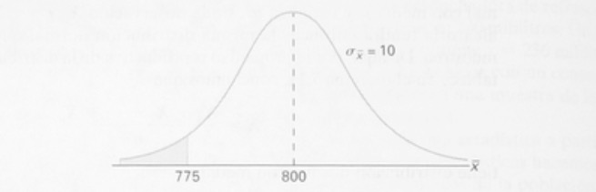
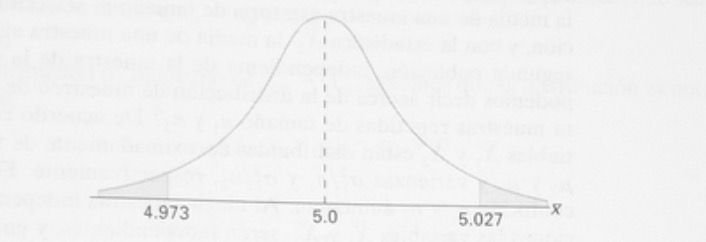
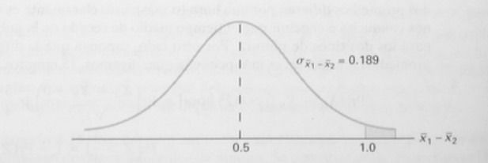

# Distribuciones muestrales

El objetivo del análisis estadístico es obtener conocimiento con respecto a ciertas propiedades en un población que son de interés para un investigador. El **muestreo** es una de las formas más frecuentes de obtener información acerca de una población de interés. Por ejemplo, podemos afirmar, con base en las opiniones de varias personas entrevistadas en las calles de Santiago de Chile, que aproximadamente el 70% prefiere una determinada marca de automovíl. En este caso tratamos con una muestra aleatoria de opiniones de una población finita muy grande. Finalmente, consideremos una máquina despachadora de refrescos en la que la cantidad promedio de bebida servida se mantiene en 240 mililitros. Un inspector de calidad de la compañia calcula la media de 40 bebidas y obtiene $\bar x = 236$ mililitros, y con base en este valor decide que la maquina aún sirve bebidas  con un contenido premedio de $\mu = 240$ mililitros. Las 40 bebidas representan una muestra de la población infinita de posibles bebidas que esta máquina servirá.

**Definición**. La distribución de probabilidad de una estadística se llama **distribución muestral.**
La distribución muestral de probabilidad de $\bar X$ se llamada **distribución muestral de la media.**

## Distribuciones muestrales de medias

La primera distribución muestral importante a considerar es la media $\bar X$. Suponga una muestra aleatoria de tamaño $n$ se toma de una población normal con media $\mu$ y varianza $\sigma^{2}$. Cada observación $\bar X_{i}, i=1,2...,n$, de la muestra aleatoria tendrá entonces la misma distribución normal que la población que se muestrea. Tenemos:

\begin{equation} 
\bar X = \frac{X_{1}+X_{2}+...+X_{n}}{n} \nonumber
\end{equation}

tiene una distribución normal con media

\begin{equation} 
\mu_{\bar X} = \frac{\mu+\mu+...+\mu}{n} = \mu \nonumber
\end{equation}

y varianza 

\begin{equation} 
\sigma^{2}_{\bar x} = \frac{\sigma^{2}+\sigma^{2}+...+\sigma^{2}}{n^{2}} = \frac{\sigma^{2}}{n}. \nonumber
\end{equation}

Si tomamos muestras de una población con distribución desconocida, finita o infinita, la distribución muestral de $\bar X$ aún será aproximadamente normal con media $\mu$ y varianza $\sigma^{2}/n$ siempre que el tamaño sea grande. El resultado anterior se debe al teorema del límite central.

**Definición.** **Teorema del límite central**: si $\bar X$ es la media de una muestra aleatoria de tamaño $n$ tomada de una población con media $\mu$ y varianza $\sigma^{2}/n$, entonces la forma límite de la distribución de 

\begin{equation} 
Z = \frac{\bar X - \mu}{\sigma/\sqrt[]{n}},  \nonumber
\end{equation}

conforme $n \longrightarrow \infty$, es la distribución normal estándar $n(z;0,1)$.

**Ejemplo**: Una empresa eléctrica fabrica focos que tienen una duración que se distribuye aproximadamente en forma normal, con media $800$ horas y desviación estándar de 40 horas. Encuentre la probabilidad de que una muestra aleatoria de $16$ focos tenga una vida promedio de menos de $775$ horas.

```{r pressure2, echo=FALSE, fig.cap="Área de focos con una vida menor a 775 horas", out.width = '85%'}

```

**Solución**: La distribución muestral de $\bar X$ será aproximadamente normal, con $\mu_{\bar X}=800$ y $\sigma_{\bar X}=40/\sqrt[]{16}=10$. La probabilidad que se desea está dada por el área de la región sombreada de la figura de arriba.

En correspondencia con $\bar x = 775$, encontramos que 

\begin{equation} 
z = \frac{775 - 800}{10} = -2.5,  \nonumber
\end{equation}

y por lo tanto

\begin{equation} 
P(\bar X < 775) = P(Z < -2.5) = 0.0062.  \nonumber
\end{equation}


```{r pressure, echo=FALSE, fig.cap="Área de distribución tamaño de las piezas", out.width = '85%'}

```

### Inferencia sobre la media de la población

Una aplicación muy importante del teorema central del límite es determinar los valores razonables de la media de la población $\mu$. Temas como la prueba de hipótesis, estimación, control de calidad emplean este teorema.


**Ejempllo**: Un proceso manufacturero produce partes de componente cilíndricos para la industria automotriz. Este proceso debe producir partes que tenga una media de 5 milímetros. Se lleva a cabo un experimento en el que $100$ partes elaboradas por el proceso se seleccionan al azar y se mide el diámetro de cada una de ellas. Se sabe que la desviación estándar de la población es $\sigma = 0.1$. El experimento indica un diámetro promedio de la muestra $\bar x = 5.027$ milímetros. ¿ Esta información de la muestra parece apoyar o refutar la conjetura del ingeniero?

**Solución**: Si los datos apoyan o rechazan la conjetura depende de la probabilidad de que los datos similares a los obtenidos en este experimento $(\bar x = 5.027)$ pueden ocurrir con facilidad cunado $\mu = 5.0$ (ver figura de arriba). Entonces, ¿qué tan probable es que se observe una $\bar x \geq 5.027$ con $n=100$ si la media de la población es $\mu = 5.0$? Si esta probabilidad sugiere que $\bar x = 5.027$, la conjetura no se rechaza. Si la probabilidad es bastante baja, se puede argumentar que los datos no apoyan la conjetura $\mu = 5.0$. La probabilidad que elijamos calcular está dada por $Pr[|\bar X - 5| \geq 0.027]$.

En otra palabras, si la media  $\mu$ es $5.0$, ¿cuál es a probabilidad de que $\bar X$ se desvíe a los más en $0.027$ milímetros?

\begin{equation} 
\begin{split}
Pr[|\bar X - 5| \geq 0.027] & = Pr[(\bar X - 5) \geq 0.027] + Pr[(\bar X - 5) \leq 0.027] \\
& = 2P\left(\frac{\bar X - 5.0}{0.1/\sqrt(100)} \right) \geq 2.7.\nonumber
\end{split}  
\end{equation}

Aquí simplemente estandarizamos $\bar X$ de acuerdo con el teorema del límite central.

Si la *conjetura* $\mu = 5.0$ *es cierta*, $\frac{\bar X - 5.0}{0.1/\sqrt(100)}$ es $N(0,1)$. Así

\begin{equation} 
2P\left(\frac{\bar X - 5.0}{0.1/\sqrt(100)} \right) \geq 2.7 = 2P(Z \geq 2.7) = 2(0.0035) = 0.007.\nonumber
\end{equation}

De esta manera se experimente una $\bar x$ que está a $0.027$ milímetros de la media en sólo siete de $1000$ experimentos. Como resultado, este experimento con $\bar = 5.027$ ciertamente no proporciona un soporte a la conjetura que $\mu = 5.0$.


### Distribución muestral de la disferencia entre dos promedios

Una aplicación mucho más interesante incluye dos poblaciones. Un cientifico o ingeniero se interesa en un experimento comparativo en el cual se tiene dos métodos de producción, $1$ y $2$. La base de comparación es $\mu_{1} - \mu_{2}$, la diferencia de las medias poblacionalees.

Suponga que tenemos dos poblaciones, la primera con media $\mu_{1}$ y varianza $\sigma^{2}_{1}$,la segunda con media $\mu_{2}$ y varianza $\sigma^{2}_{2}$. Tenemos $\bar X_{1}$ la media de una aleatoria de tamaño $n_{1}$ proveniente de la primera población, y $\bar X_{2}$ la media de una aleatoria de tamaño $n_{2}$ proveniente de la segunda población, independiente de la muestra de la primera población. ¿ Qué podemos decir con respecto al muestreo de la diferencia $\bar X_{1} - \bar X_{2}$ para muestras repetidas de tamaño $n_{1}$ y $n_{2}$? De acuerdo con el teorema del limite central, la variables $\bar X_{1}$ y $\bar X_{2}$ están distribuidas aproximadamente de forma normal con medias de $\mu_{1}$ y $\mu_{2}$ y varianza $\sigma^{2}_{2}/n_{1}$ y $\sigma^{2}_{2}/n_{2}$, respectivamente. Esta aproximación mejora con el incremento de $n_{1}$ y $n_{2}$. Al elegir muestras independientes de las dos poblaciones las variables $\bar X_{1}$ y $\bar X_{2}$ serán independientes, por lo tanto podemos concluir que $\bar X_{1} - \bar X_{2}$ está distribuida aproximadamente normal con media 

\begin{equation} 
\mu_{\bar X_{1}-\bar X_{2}} = \mu_{\bar X_{1}} - \mu_{\bar X_{2}} = \mu_{1} - \mu_{2} \nonumber
\end{equation}

y varianza

\begin{equation} 
\sigma^{2}_{\bar X_{1}-\bar X_{2}} = \sigma^{2}_{\bar X_{1}} - \sigma^{2}_{\bar X_{2}} = \frac{\sigma^{2}_{1}}{n_{1}} - \frac{\sigma^{2}_{2}}{n_{2}}. \nonumber
\end{equation}

**Teorema**: Si se extraen al azar muestras independientes de tamaño $n_{1}$ y $n_{2}$ de dos poblaciones, discretas o continuas, con medias $\mu_{1}$ y $\mu_{2}$ y y varianza $\sigma^{2}_{2}$, respectivamente, entonces la distribución muestral de las diferencias de las medias, $\bar X_{1} - \bar X_{2}$, está distribuida de forma normal con medias y varianza dadas por 

\begin{equation} 
\mu_{\bar X_{1}-\bar X_{2}} =  \mu_{1} - \mu_{2} \quad y \quad \sigma^{2}_{\bar X_{1}-\bar X_{2}} = \frac{\sigma^{2}_{1}}{n_{1}} - \frac{\sigma^{2}_{2}}{n_{2}}. \nonumber
\end{equation}

De aquí se tiene

\begin{equation} 
Z = \frac{(\bar X_{1} - \bar X_{2}) - (\mu_{1} - \mu_{2})}{\sqrt{(\frac{\sigma^{2}_{1}}{n_{1}}) - (\frac{\sigma^{2}_{2}}{n_{2}})}} \nonumber
\end{equation}

es aproximadamente una variable normal estándar.


**Ejemplo**: Las bombillas del fabricante **A** tienen una duración media de $6.5$ años y una desviación estándar de $0.9$ años, mientras que las del fabricante **B** tienen una diración media de $6.0$ años y una desviación estándar de $0.8$ años. ¿Cuál es la probabilidad de que una muestra aleatoria de 36 bombillas del fabricante **A** tengan una duración media que sea menos de un años más que la duración media de una muestra de 49 bombillas del fabricante **B**?

**Solución**:
La información suministrada es la siguiente

\begin{center}
\begin{tabular}{c c}
 Población 1 & Población 2 \\ 
 \hline
$\mu_{1} = 6.5$ & $\mu_{2} = 6.0$ \\
$\sigma_{1} = 0.9$ & $\sigma_{2}= 0.8$ \\
$n_{1} = 36$ & $n_{2} = 49$
\end{tabular}
\end{center}

Si utilizamos en teorema de la diferencia de medias, la distribución de $\bar X_{1} - \bar X_{2}$ será aproximadamente normal y tendrá una media y una desviación estándar de 

\begin{equation} 
\mu_{\bar X_{1}-\bar X_{2}} =  6.5 - 6.0 \quad y \quad \sigma_{\bar X_{1}-\bar X_{2}} = {\sqrt{\frac{0.81}{36} - \frac{0.64}{49}}} = 0.189. \nonumber
\end{equation}

La probabilidad de que la media de 36 bombillas del fabricante **A** sea al menos un año mayor que la media de 49 bombillas del fabricante **B** está dada por el área de la región sombreada de la figura 3. Con respecto al valor $\bar x_{1} - \bar x_{2} = 1.0$, encontramos que

\begin{equation} 
z = \frac{1.0 - 0.5}{0.189} = 2.65,  \nonumber
\end{equation}

```{r pressure3, echo=FALSE, fig.cap="Área de distribución tamaño de las piezas", out.width = '85%'}

```

y de aquí se tiene

\begin{equation} 
P(\bar X_{1} - \bar X_{1} \geq 1.0) = P(Z \geq 2.65) = 1-P(Z < 2.65) = 1-0.9960 = 0.0040.  \nonumber
\end{equation}


