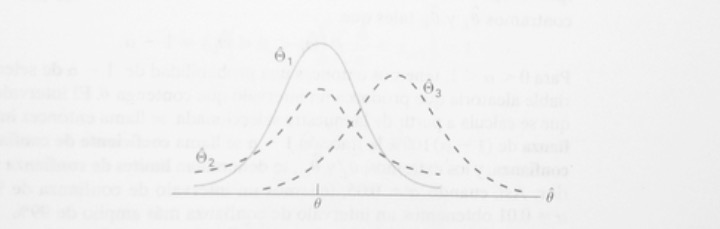
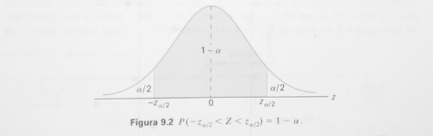

# Introducción
Muestras obtenidas de distribuciones conocidas donde los parámetros son desconocidos que caracterizan la distribución serán de interés. Para especificar completamente una distribución de probabilidad, si es discreta o continua, la distribución de los parámetros deber ser especificada. Por ejemplo, una variable aleatoria puede seguir una distribución normal; sin embargo, si tanto la media y la desviación estándar de la distribución normal son desconocidas, la distribución en cuestión no puede ser completamente especificada. De manera similar, la variables aleatoria de Poisson requiere el conocimiento del parámetro $\lambda$ para especificar completamente la distribución. En general, la **pdf** de una variable aleatoria $X$ es $f(x|\theta)$, donde $\theta$ es el vector de parámetros que caracterizan la **pdf**. El vector de parámetros $\theta$ es definido sobre el espacio de parámetros $\Theta$. Para cada valor de $\theta \in \Theta$, hay una **pdf** diferente. Para obtener estos posibles valores del vector de parámetros, una muestra aleatoria de la población toma sumo interés, y las estadísticas llamadas **estimadores** son construidos. Los valores de los estimadores son llamados **estimaciones puntuales**. Por ejemplo, $\bar X$ puede ser empleada como un estimador puntual para $\mu$; en cual caso, $\bar x$ es un estimador puntual de $\mu$. 


## Propiedades de los estimadores

### Estimador insesgado

Sea $\hat{\Theta}$ un estimador cuyo valor $\hat{\theta}$ es una estimación puntual de algún parámetro poblaciones desconocido $\theta$. Deseariamos que distribución muestral de $\hat{\Theta}$ tuviera una media igual al parámetro estimado. Se dice que un estimador que posee esta propiedad es **insesgado**.

**Definición**: Se dice que una estidística  $\hat{\Theta}$ es un estimador **insesgado** del parámetro $\theta$ si $\mu_{\hat{\Theta}}= E(\hat{\Theta})=\theta$.


### Varianza de un estimador puntual

Si $\hat{\Theta}_{1}$ y $\hat{\Theta}_{2}$ son dos estimadores insesgados del mismo parámetro poblacional $\theta$, elegiríamos el estimador cuya distribución muestral tuviera la menor varianza. De aquí, si $\sigma_{\hat{\Theta}_{1}} < \sigma_{\hat{\Theta}_{2}}$, decimos que $\sigma_{\hat{\Theta}_{1}}$ es un **estimador más eficiente** de $\theta$ que $\hat{\Theta}_{2}$.

**Definición**: Si consideramos todos los posibles estimadores insesgados de algún parámetro $\theta$, el de menor varianza se llama **estimador más eficiente** de $\theta$.

```{r pressure1, echo=FALSE, fig.cap="Distribución muestral de diferentes estimadores", out.width = '85%'}

```


### Estimador consistente

La siguiente propiedad deseable de un estimador es la **consistencia**. La consistencia es la propiedad de una secuencia de estimadores más que de un solo estimador; sin embargo, es bastante común referirse a un estimador como consistente. Una secuencia de estimadores significa que la misma estimación procede de cada cada tamaño muestral $n$. Si $\hat{\theta}$ es un estimador de $\theta$ y $x_{1}, x_{2}, ...$ son observados de acuerdo a una distribución $f(x|\theta)$, una secuencia de estimadores $\hat{\theta_{1}},\hat{\theta_{2}},...,\hat{\theta_{n}}$ pueden ser construidos mediante el mismo proceso de estimación mediante los tamaños muestrales $1,2,...,n$, respectivamente.

\begin{equation} 
\hat{\theta_{1}} = f(x_{1}), \hat{\theta_{2}} = f(x_{1},x_{2}),...,\hat{\theta_{n}} = f(x_{1},x_{2},...,x_{n}).    \nonumber
\end{equation}

Una secuencia de estimadores $\hat{\theta_{n}}$ (definidos para todo $n$) es un estimador **consistente** del parámetro $\theta$ para todo $\theta \in \Theta$ si

\begin{equation} 
\displaystyle\lim_{x \to{}\infty}{P(|\hat{\theta_{n}}-\theta| \geq \epsilon)} = 0, \quad para \quad todo \quad \epsilon>0. \nonumber
\end{equation}

Una secuencia de estimadores **convergen en probabilidad** a el parámetro $\theta$, donde $\theta$ es el parámetro de la secuencia consistente de estimadores estimados. En términos prácticos, esto implica que la varianza de de un estimador consistente disminuye cuando $n$ aumenta y que el valor esperado de $\hat{\theta_{n}}$ tiende a $\theta$ tanto como $n$ incrementa.

### Estimadores robustos

La esencia de un estimador **robusto** es un estimador cuya distribución muestral no es seriamente afectada por la violación de algunos supuestos subyacentes. Por ejemplo, mala especificación de la distribución muestral. El concepto de robustes también se emplea para referirse a la habilidad de un estimador particular para proveer estimaciones razonables cuando existen observaciones atípicas en la muestra.

**Ejemplo**. Un botánico está interesado en estudiar el efecto de un nuevo herbicida en los trebol blancos midiendo y registrando la longitud del tallo en centímetros de 10 espécimenes como $5.3, 2.8, 3.4, 7.2, 8.3, 1.7, 6.2, 9.3, 3.2, 5.9$, Calcular la media, la mediana la desviación estándar y la **desviación absoluta mediana**. Suponer que el botánico comete un error al registrar 83 en vez de 8.3. ¿Cómo afecta este error los calculo?

**Solución**: la medición de los tallos ingresas sin error se encuentran el el vector *stem1* y la medición de los tallos ingresas con error se encuentran el el vector *stem2*.


```{r}
stem1 <- c(1.7, 2.8, 3.2, 3.4, 5.3, 5.9, 6.2, 7.2, 8.3, 9.3)
stem2 <- c(1.7, 2.8, 3.2, 3.4, 5.3, 5.9, 6.2, 7.2, 83, 9.3)
c(mean(stem1), sqrt(var(stem1)))
c(mean(stem2), sqrt(var(stem2)))
c(median(stem1), mad(stem1, constant = 1))
c(median(stem2), mad(stem2, constant = 1))
median(abs(stem1 - median(stem1)))
median(abs(stem1 - median(stem1)))
```


Notar que la media y la desviación estándar de *stem1* $(5.33,2.5166)$ son totalmente diferentes *stem2* $(12.8,24.77185)$, sin embargo, la mediana y $MAD$ $(5.6,2.3)$ son iguales. Lo que demuestra la robustes de la media y la $MAD$ de valores atípicos. 

**Nota**: $MAD = mediana|x_{i}-mediana \quad muestral|$.


## Estimación por intervalo

UNa estimación por intervalo de un parámetro poblacional $\theta$ es un intervalo de la forma $\hat{\theta_{L}}<\theta<\hat{\theta_{U}}$, donde $\hat{\theta_{L}}$ y $\hat{\theta_{U}}$ dependen del valor de la estadística $\hat{\Theta}$. Así, una muestra de calificaciones de la PSU para estudiantes de una clase podría generar un intervalo de $530$ a $550$, dependerán de la media muestral calculada $\bar x$ y de la distribución de $\bar X$ A medida que el tamaño de la muestra aumenta, sabemos que $\sigma^{2}_{n} = \sigma^{2}/n$ disminuye, y en consecuencia es probable que nuestra estimación esté cercana al parámetro $\mu$, lo que tiene como resultado un intervalo más pequeño. De esta manera el intervalo estimado indica, por su longitud, la precisión de la estimación puntual. Un ingeniero obtendrá una idea de la proporción de la población de artículos defectuosos al tomar una muestray calcular la proporción de de defectuosos de la muestra. Pero una estimación por intervalo podría ser más informativa.

Debido a que muestras distintas por lo general darán valores diferentes de $\hat{\Theta}$ y, por lo tanto, valores distintos $\hat{\theta_{L}}$ y $\hat{\theta_{U}}$, estos puntos extremos del intervalo son valores de las variables aleatorias correspondientes a $\hat{\Theta_{L}}$ y $\hat{\Theta_{U}}$. De la distribución muestral de $\hat{\Theta}$ seremos capaces de determinar $\hat{\theta_{L}}$ y $\hat{\theta_{U}}$ de modo que $P(\hat{\Theta_{L}}< \theta < \hat{\Theta_{U}})$ sea igual a algún valor fraccional positivo que queremos especificar. Si por ejemplo, encontramos $\hat{\theta_{L}}$ y $\hat{\theta_{U}}$ tales que 

\begin{equation} 
P(\hat{\Theta_{L}}< \theta < \hat{\Theta_{U}}) = 1 - \alpha, \nonumber
\end{equation}

para $0 < \alpha < 1$, tenemos entonces una probabilidad de $1 - \alpha$ de seleccionar una variables aleatoria que produzca un intervalo que contenga $\theta$. El intervalo $\hat{\theta_{L}}< \theta < \hat{\theta_{U}}$, que se calcula de la muestra seleccionada, se llama **intervalo de confianza** de $(1 - \alpha)100\%$ y la fracción $1 - \alpha$ se llama **coeficiente de confianza** o **grado de confianza**, y los extremos $\hat{\theta_{L}}$ y $\hat{\theta_{U}}$, se denominan **límites de confianza** inferior y superior. Así, cuando $\alpha = 0.05$, tenemos un intervalo de confianza de $95\%$, y cuando tenemos $\alpha = 0.01$, tenemos un intervalo de confianza más amplio de $99\%$. Entre más amplio sea el inteervalo de confianza podemos tener más confianza de que el intervalo dado contenga el parámetro desconocido.

### Intervalo de confianza para la media poblacional 

La distribución muestral de $\bar X$ está centrada en $\mu$ y en la mayoría de las aplicaciones la varianza es más pequeña que la de cualquiera otros estimadores de $\mu$. Así, la media muestra se utilizará como una esitimación puntual para la media de la población $\mu$. Rocordar que $\sigma^{2}_{\bar X} = \sigma^{2}/n$, por lo que una muestra grande dará un valor de $\bar X$ que proviene de una distribución de muestreo con varianza pequeña. De aquí que $\bar x$ se una estimación muy precisa de $\mu$ cuando $n$ es grande.

Ahora consideremos la estimación por intervalos de $\mu$. Si la muestra seleccionada proviene de una población normal, a falta de ésta, si $n$ es suficientemente grande, podemos establecer un intervalo de confianza para $\mu$ al considerar la distribución muestral de $\bar X$. Siguiendo el teorema del límite central, podemos esperar que la distribución muestral $\bar X$ esté distribuida de forma aproximadamente normal como media $\mu_{\bar X}=\mu$ y desvaición estándar $\sigma_{\bar X}=\sigma/\sqrt{n}$. Al escribir $z_{\alpha/2}$ para el valor $z$ por arriba del cual encontramos un área de $\alpha/2$, podemos ver la siguiente gráfica que 


```{r pressure2, echo=FALSE, fig.cap="", out.width = '85%'}

```

\begin{equation} 
P(-z_{\alpha/2}< Z< z_{\alpha/2}) = 1- \alpha, \nonumber
\end{equation}

donde

\begin{equation} 
Z = \frac{\bar X - \mu}{\sigma / \sqrt{n}}. \nonumber
\end{equation}

Por lo tanto

\begin{equation} 
P(-z_{\alpha/2}< \frac{\bar X - \mu}{\sigma / \sqrt{n}} < z_{\alpha/2}) = 1- \alpha, \nonumber
\end{equation}

Al multiplicar cada término en la desigualdad por $\sigma / \sqrt{n}$, y después restar $\bar X$ de cada término y multiplicar por $-1$ (para invertir el sentido de la desigualdad), obtenemos

\begin{equation} 
P(\bar X - z_{\alpha/2} \sigma / \sqrt{n} < \mu < \bar X + z_{\alpha/2} \sigma / \sqrt{n}) = 1- \alpha. \nonumber
\end{equation}

**Intervalo de confianza de $\sigma$; con $\sigma$ conocida**: Se selecciona una muestra aleatoria de tamaño $n$ de una población cuya varianza es $\sigma^{2}$ se conoce y se calcula la media muestral $\bar x$ para obtener el siguiente intervalo de confianza de $(1-\alpha)100\%$ para $\mu$

\begin{equation} 
\bar x - z_{\alpha/2} \sigma / \sqrt{n} < \mu < \bar x + z_{\alpha/2} \sigma / \sqrt{n} = 1- \alpha. \nonumber
\end{equation}

donde $z_{\alpha/2}$ es el valor $z$ que deja un área de ${\alpha/2}$ a la derecha

Para muestras pequeñas que se seleccionan de poblaciones no normales, no podemos esperar que el grado de confianza sea preciso. Sin embargo, para muestras de tamaño $n\ge 30$, sin importar la forma de la mayor parte de las poblaciones, la teoría de muestreo garantiza buenos resultados.

Claramente, los resultados de las variables aleatorias $\hat{\Theta}_{L}$ y $\hat{\Theta}_{U}$, que se definieron anteriormente, son los límites de confianza

\begin{equation} 
\hat{\theta}_{L} = \bar x - z_{\alpha/2} \sigma / \sqrt{n} \quad y \quad \hat{\theta}_{U} = \bar x + z_{\alpha/2} \sigma / \sqrt{n}. \nonumber
\end{equation}


**Ejemplo**: Escribimos una función que generará $100$ muestras, cada una de tamaño $36$, de una distribución $N(100,18)$. Para cada una de las $100$ muestras de tamaño $36$, claculamos un intervalo de confianza del $95\%$ para la media poblacional. Porteriormente, gráficamos los intervalos de confianza, resaltamos aquellos que no contienen $\mu = 100$. Finalmente, determinamos cuantos intervalos de los $100$ contienen la media poblacional, $\mu = 100$. Este número es el nivel de confianza simulado.


```{r}
# Código de R

norsimulada <- function(simular = 100, n = 36, mu = 100, sigma = 18,
 niv.confianza = 0.95) {
  alpha <- 1 - niv.confianza
LimC <- niv.confianza * 100
Liml <- numeric(simular)
Limu <- numeric(simular)
for (i in 1:simular) {
xbar <- mean(rnorm(n, mu, sigma))
Liml[i] <- xbar - qnorm(1 - alpha/2) * sigma/sqrt(n)
Limu[i] <- xbar + qnorm(1 - alpha/2) * sigma/sqrt(n)
}
notin <- sum((Liml > mu) + (Limu < mu))
porcentaje <- round((notin/simular) * 100, 2)
SCL <- 100 - porcentaje
plot(Liml, type = "n", ylim = c(min(Liml), max(Limu)), xlab = " ",
ylab = " ")
for (i in 1:simular) {
low <- Liml[i]
high <- Limu[i]
if (low < mu & high > mu) {
segments(i, low, i, high)
} else if (low > mu & high > mu) {
segments(i, low, i, high, col = "red", lwd = 5)
} else {
segments(i, low, i, high, col = "blue", lwd = 5)
}
}
abline(h = mu)
cat(SCL, "95% de los intervalos de confianza aleatorios contienen Mu = 100")
}
```


```{r}
set.seed(10)
norsimulada(simular = 100, n = 36, mu = 100, sigma = 18, niv.confianza = 0.95)
```


