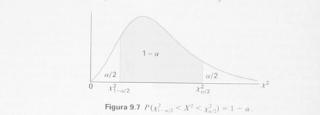

### Intervalo de confianza para la media poblacional 

**Ejemplo**: Se encuentra que la concentración promedio de zinc que se saca del agua a àrtir de una muestra de mediciones de sinc en 36 sities diferentes es de $2.6$ gramos ppor mililitro. Encuentre los intervalos de confianza de $95\%$ y $99\%$ para la concentración de zinc en el río. Soponga que la desvación estándar de la población es de $0.3$.

**Solución**: La estimación puntual de $\mu$ es $\bar x = 2.6$. El valor $z$, que deja un area de $0.025$ a la derecha y por tanto un área de $0.975$ a la izquierda, es $z_{0.025}=1.96$ De aquí que el intervalo de confianza de 95% es 

\begin{equation} 
2.6 - (1.96) \left(\frac{0.3}{\sqrt{36}}\right) < \mu < 2.6 + (1.96) \left(\frac{0.3}{\sqrt{36}}\right), \nonumber
\end{equation}

\begin{equation} 
2.50 < \mu < 2.7. \nonumber
\end{equation}

Para encontrar un intervalo de confianza de $99\%$, encontramos el valor $z$ que deja un área de 0.005 a la derecha y de 0.995 a la izquierda. Por lo tanto, empleando la table del área bajo la curva normal de nuevo, $z_{0.005}=2.575$, y el intervalo de confianza de $99\%$ es

\begin{equation} 
2.47 < \mu < 2.73. \nonumber
\end{equation}

Vemos ahora que se requiere un intervalo más grande para estimar $\mu$ con un grado más alto de precisión.

**Teorema**: Si se emplea $\bar x$ como una estimación de $\mu$, podemos tener una confianza de $(1-\alpha)100\%$ de que el error no excederá de $z_{\alpha/2}\sigma/\sqrt{n}$.

**Teorema**: Si $\bar x$ se emplea como estimación de $\mu$, podemos tener $(1-\alpha)100\%$ de confianza de que el error no excederá una cantidad especifica $e$ cuando el tamaño de la muestra es

\begin{equation} 
n = \left(\frac{z_{\alpha/2}\sigma}{e}\right)^{2} \nonumber
\end{equation}


**Ejemplo**: ¿Qué tan grande se requiere una muestra en el ejemplo anterior si se quiere tener $95\%$ de confianza de que nuestra estimación de $\mu$ difiera por menos de $0.05$?

**Solución**:
\begin{equation} 
n = \left(\frac{(1.96)(0.3)}{0.05}\right)^{2} = 138.3. \nonumber
\end{equation}

Con frecuencia intentamos  estimar la media de una población cuando se desconoce la varianza. **Debe recordar de la unidad 8.8** que si tenemos una muestra aleatoria a partir de una *distribución normal*, entonces la variable aleatoria

\begin{equation} 
T = \frac{\bar X - \mu}{S/\sqrt{n}}  \nonumber
\end{equation}

tiene una distribución $t$ de Student con $n-1$ grados de libertad. Aquí $S$ es la desviación estándar de la muestra. En este caso donde se desconoce $\sigma$ se puede utilizar $T$ para estimar un intervalo de confianza de $\mu$.

```{r pressure1, echo=FALSE, fig.cap="Distribución muestral de diferentes estimadores", out.width = '85%'}
knitr::include_graphics("fig8.jpeg")
```

El procedimiento es el mismo que cuando se conoce $\sigma$ excepto que se reemplaza $\sigma$ por $S$ y la distribución normal estándar por la distribución $t$.


\begin{equation} 
P(\bar X - t_{\alpha/2} S/\sqrt{n} < \mu < \bar X + t_{\alpha/2} S/\sqrt{n}) = 1- \alpha. \nonumber
\end{equation}

Para nuestra muestra aleatoria de tamaño $n$, se calcula la media $\bar x$ y la desviación estándar $s$ y se obtiene el siguiente intervalo de confianza de $(1-\alpha)100\%$ para $\mu$ 

\begin{equation} 
\bar x - t_{\alpha/2} s/ \sqrt{n} < \mu < \bar x - t_{\alpha/2} s/ \sqrt{n},  \nonumber
\end{equation}

donde $t_{\alpha/2}$ es el valor $t$ con $v = n-1$ grados de libertad, que deja un área a la derecha de ${\alpha/2}$.


## Dos muestras: estimación de la diferencia enrtre medias

**Intervalo de confianza para $\mu_{1}-\mu_{2}$; con $\sigma_{1}$ y $\sigma_{2}$ conocidas**: Si $\bar x_{1}$ y $\bar x_{2}$ son las medias de muestras aleatorias independientes de tamaño $n_{1}$ y $n_{2}$ de poblaciones con varianzas conocidas $\sigma_{1}$ y $\sigma_{2}$, respectivamente, un intervalo de confinaza de $(1-\alpha)100\%$ para $\mu_{1}-\mu_{2}$ está dado por

\begin{equation} 
(\bar x_{1} - \bar x_{2}) - z_{\alpha/2} \sqrt{\frac{\sigma_{1}^{2}}{n_{1}} + \frac{\sigma_{1}^{2}}{n_{2}}} < \mu_{1}-\mu_{2} < (\bar x_{1} - \bar x_{2}) + z_{\alpha/2} \sqrt{\frac{\sigma_{1}^{2}}{n_{1}} + \frac{\sigma_{1}^{2}}{n_{2}}}, \nonumber
\end{equation}

donde $z_{\alpha/2}$ es el valor $z$ que deja un área de ${\alpha/2}$ a la derecha.

**Intervalo de confianza para $\mu_{1}-\mu_{2}$; con $\sigma_{1} = \sigma_{2}$ pero desconocidas**: Si $\bar x_{1}$ y $\bar x_{2}$ son las medias de muestras aleatorias independientes de tamaño $n_{1}$ y $n_{2}$ de poblaciones con varianzas iguales pero desconocidas, intervalo de confianza de $(1-\alpha)100\%$ para $\mu_{1}-\mu_{2}$ está dado por

\begin{equation} 
(\bar x_{1} - \bar x_{2}) - t_{\alpha/2}S_{p} \sqrt{\frac{1}{n_{1}} + \frac{1}{n_{2}}} < \mu_{1}-\mu_{2} < (\bar x_{1} - \bar x_{2}) + t_{\alpha/2}S_{p} \sqrt{\frac{1}{n_{1}} + \frac{1}{n_{2}}}, \nonumber
\end{equation}

donde $S_{p}$ es la estimación de unión de la desviación estándar poblacional y  $t_{\alpha/2}$ es el valor $t$ con $v = n_{1}+n_{1}-2$ grados de libertad, que deja un área de ${\alpha/2}$ a la derecha.

\begin{equation} 
S_{p} = \frac{(n_{1}-1)s_{1}^{2} + (n_{2}-1)s_{2}^{2}}{n_{1}+n_{1}-2} \nonumber
\end{equation}


**Intervalo de confianza para $\mu_{1}-\mu_{2}$; con $\sigma_{1} \ne \sigma_{2}$ pero desconocidas**: Si $\bar x_{1}$ y $s_{1}$ y $\bar x_{2}$ y $s_{2}$ son las medias y las varianzas de muestras aleatorias independientes de tamaño $n_{1}$ y $n_{2}$ , respectimente,de distribuciones aproximadamente normales con varianzas diferentes y desconocidas, intervalo de confianza de $(1-\alpha)100\%$ para $\mu_{1}-\mu_{2}$ está dado por

\begin{equation} 
(\bar x_{1} - \bar x_{2}) - t_{\alpha/2} \sqrt{\frac{s_{1}^{2}}{n_{1}} + \frac{s_{2}^{2}}{n_{2}}} < \mu_{1}-\mu_{2} < (\bar x_{1} - \bar x_{2}) + t_{\alpha/2} \sqrt{\frac{s_{1}^{2}}{n_{1}} + \frac{s_{2}^{2}}{n_{2}}}, \nonumber
\end{equation}

\begin{equation} 
v = \frac{(s_{1}^{2}/n_{1} + s_{2}^{2}/n_{2})^{2}}{[(s_{1}^{2}/n_{1})^{2}/(n_{1}-1)]+[(s_{2}^{2}/n_{2})^{2}/(n_{2}-1)]}, \nonumber
\end{equation}

grados de libertad, que deja $\alpha/2$ a la derecha.


## Una sola muestra: estimación de una proporción

**Intervalo de confianza para *p* de una muestra grande**: Si $\hat{p}$ es la proporción de éxitos en una muestra aleatoria de tamaño $n$, y $\hat{q} = 1- \hat{p}$, un intervalo de confianza $(1-\alpha)100\%$ para el parámetro binomial $p$ está dado por 

\begin{equation} 
\hat{p} - z_{\alpha/2} \sqrt{\frac{\hat{p}\hat{q}}{n}} < p < \hat{p} + z_{\alpha/2} \sqrt{\frac{\hat{p}\hat{q}}{n}} \nonumber
\end{equation}

donde $z_{\alpha/2}$ es el valor $z$ que deja un área de ${\alpha/2}$ a la derecha.

**Ejemplo**: En una muestra aleatoria de $n = 500$ familias que viven en la ciudad de Antofagasta, Chile, se encuentran que $x=340$ tiene una suscripción a *Netflix*. Encuentre un intervalo de confianza de $95\%$ para la proporción real de familias en esta ciudad con suscripción a *Netflix* 

**Solución**: La estamación puntual de $p$ es $\hat{p}=340/500=0.68$. Con el uso de la tabla del área bajo la curva normal, encontramos que $z_{0.025}=1.96$. Por lo tanto, el intervalo de confianza de $95\%$ para $p$ es 

\begin{equation} 
0.68 - 196 \sqrt{\frac{(0.68)(0.32)}{500}} < p < 0.68 + 196 \sqrt{\frac{(0.68)(0.32)}{500}}, \nonumber
\end{equation}

que se simplifica a $0.68<p<0.72$.


## Dos muestras: estimación de la diferencia entre dos proporciones 

**Intervalo de confianza para $p_{1}-p_{2}$ de una muestra grande**: Si $\hat{p_{1}}$ y $\hat{p_{1}}$ son las proporciones de éxitos en muestras aleatorias de tamaño $n_{1}$ y $n_{2}$, y $\hat{q_{1}} = 1- \hat{p_{1}}$ y $\hat{q_{2}} = 1- \hat{p_{2}}$, un intervalo de confianza $(1-\alpha)100\%$ para la diferencia de dos parámetros binomiales $p_{1}-p_{2}$ está dado por 

\begin{equation} 
(\hat{p_{1}} - \hat{p_{2}}) - z_{\alpha/2} \sqrt{\frac{\hat{p_{1}}\hat{q_{1}}}{n_{1}} + \frac{\hat{p_{2}}\hat{q_{2}}}{n_{2}}} < p_{1} - p_{2} < (\hat{p_{1}} - \hat{p_{2}}) + z_{\alpha/2} \sqrt{\frac{\hat{p_{1}}\hat{q_{1}}}{n_{1}} + \frac{\hat{p_{2}}\hat{q_{2}}}{n_{2}}}   \nonumber
\end{equation}

donde $z_{\alpha/2}$ es el valor $z$ que deja un área de ${\alpha/2}$ a la derecha.

**Ejemplo**: Se consideran cierto cambio de proceso de fabricación de partes de las partes de un determinado componente. Se toman muestras del procedimiento existente y del nuevo para determinar si éste tiene como resultado una mejoría. Si se encuentra que $75$ de $1500$ artículos del procedimiento actual son defectuosos y $80$ de $2000$ artículos del procedimiento nuevo también lo son, encuentre un intervalo de confianza de $90\%$ para la diferencia real en la fracción de defectuosos entre el proceso actual y el nuevo. 


**Solución**: Sean $p_{1}$ y $p_{2}$ las proporciones reales de defectuosos para los proceso actual y nuevo, respectivamente. De aquí, $p_{1}=75/1500=0.05$ y $p_{2}=80/2000=0.04$, y la estimación puntual de $p_{1} - p_{2}$ es 

\begin{equation} 
\hat{p_{1}} - \hat{p_{2}} = 0.05-0.04=0.01   \nonumber
\end{equation}

Con el uso de la tabla del área bajo la curva normal, encontramos $z_{0.05} = 1.645$. Por lo tanto, al sustituir en esta fórmula obtenemos el intervalo de confianza de $90\%$ 

\begin{equation} 
0.01 - 1.645 \sqrt{\frac{(0.05)(0.95)}{1500} + \frac{(0.04)(0.96)}{2000}} < p_{1} - p_{2} < 0.01 + 1.645 \sqrt{\frac{(0.05)(0.95)}{1500} + \frac{(0.04)(0.96)}{2000}},   \nonumber
\end{equation}

que se simplifica a $-0.0017<p_{1} - p_{2}<0.0217$. Como el intervalo contiene el valor $0$, na hay razón para creer que el nuevo procedimiento producirá una disminución significativa en la proporción de artículos defetusos comparado con el método existente.


## Una sola muestra: estimación de la varianza

Si se extrae una muestra de tamaño $n$ de una población normal con varianza $\sigma^{2}$, y se calcula la varianza muestral $s^{2}$ obtenemos un valor de la estadística $S^{2}$. Esta varianza muestral calculada se usará como estimación puntual de $\sigma^{2}$. Por ello la estadística $S^{2}$ se llama estimador de $\sigma^{2}$.

Se puede establecer una estimación por intervalos de $\sigma^{2}$ medianyte el uso de la estadística

\begin{equation} 
\chi^{2} = \frac{(n-1)S^{2}}{\sigma^{2}}.  \nonumber
\end{equation}

La estadística $X^{2}$ tiene una distribución ji cuadrado con $n-1$ grados de libertad cuando las muestran se eligen de una población normal. Podemos escribir 

\begin{equation} 
P(X^{2}_{1-\alpha/2} < \chi^{2} < \chi^{2}_{\alpha/2}) = 1-\alpha,  \nonumber
\end{equation}

```{r pressure2, echo=FALSE, fig.cap="Distribución muestral de diferentes estimadores", out.width = '85%'}

```

\begin{equation} 
P[\chi^{2}_{1-\alpha/2} < \frac{(n-1)S^{2}}{\sigma^{2}} < \chi^{2}_{\alpha/2}] = 1-\alpha,  \nonumber
\end{equation}

\begin{equation} 
P\left[\frac{(n-1)S^{2}}{\chi^{2}_{\alpha/2}} < \sigma^{2} < \frac{(n-1)S^{2}}{\chi^{2}_{1-\alpha/2}}\right] = 1-\alpha,  \nonumber
\end{equation}

**Intervalo de confianza para $\sigma^{2}$**
Si $s^{2}$ es la varianza de una muestra aleatoria de tamaño $n$ de una población normal, un intervalo de confianza de $(1-\alpha)100\%$ para $\sigma^{2}$ es

\begin{equation} 
\frac{(n-1)S^{2}}{\chi^{2}_{\alpha/2}} < \sigma^{2} < \frac{(n-1)S^{2}}{\chi^{2}_{1-\alpha/2}},  \nonumber
\end{equation}

donde $\chi^{2}_{\alpha/2}$ y $\chi^{2}_{1-\alpha/2}$ son los valores $\chi^{2}$ con $v=n-1$ grados de libertad, que dejan áreas de ${\alpha/2}$ y ${1-\alpha/2}$, respectivamente, a la derecha.


