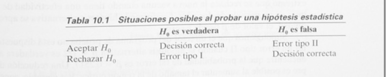
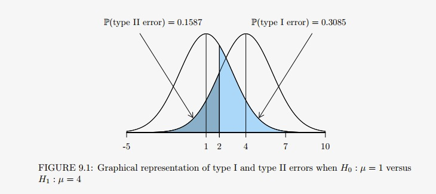
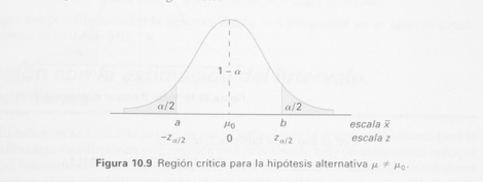
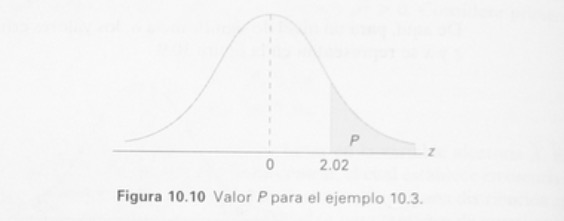

## Introducción
Regularmente, el problema al que se enfrentan científicos o ingenieros no es tanto la estimación de un parámetro poblacional, sino de poseer un procedimiento de decisión que se base en datos para obtener un conclusión acerca de un problema bajo estudio. Por ejemplo, un ingeniero puede tener que decidir sobre la base de datos muestrales si hay una defirencia en la precisión de dos maquinas. En este caso, el ingeniero *postula* o *conjetura* algo acerca del problema bajo estudio. De manera formal, la conjetura se puede poner en forma de hipótesis estadística.

**Definición**: Una **hipótesis estadística** es una aseveración o conjetura con respecto a una o más poblaciones.

La estructura de la prueba de hipótesis se formulará con el uso del término **hipótesis nula**. Éste se refiere a cualquier hipótesis que deseamos probar y se denota con $H_{0}$. El rechazo de $H_{0}$ conduce a la aceptación de una **hipótesis alternativa**, la cual se denota con $H_{1}$. Una hipótesis nula con respecto a un parámetro poblacional siempre se establecerá de modo que que especifique un valor exacto del parámetro, mientras la alternativa permite la posibilidad de varios valores.

### Prueba de una hipótesis

**Definición**: El rechazo de la hipótesis nula cuando es verdadera se llama **error tipo I**.

**Definición**: La aceptación de la hipótesis nula cuando es falsa se llama **error tipo II**.

Al probar cualquier hipótesis estadística, hay cuatro situaciones posibles que determinan si nuestra decisión es correcta o errónea. 

```{r pressure1, echo=FALSE, fig.cap="", out.width = '85%'}

```

La probabilidad de cometer un error tipo I, también llamado **nivel de significancia**, se denota con la letra griega $\alpha$.

\begin{equation} 
\alpha = P(error \quad tipo \quad I) = P(rechazar \quad H_{0}|H_{0} \quad es  \quad verdadera) =  P(aceptar \quad H_{1}|H_{0} \quad es  \quad verdadera)   \nonumber
\end{equation}

La probabilidad de cometer el error tipo II es $\beta$, donde

\begin{equation} 
\beta = P(error \quad tipo \quad II) = P(fallar \quad rechazar \quad H_{0}|H_{0} \quad es  \quad falsa) =  P(aceptar \quad H_{0}|H_{1} \quad es  \quad verdadera)   \nonumber
\end{equation}


**Ejemplo**. Dada una distribución normal con media desconocida $\mu$ y desviación estándar $\sigma = 2$, uno desearía evaluar la hipótesis nula $H_{0}: \mu = 1$ versus la hipótesis alternativa $H_{1}: \mu = 4$. De una muestra seleccionada la región de rechazo es considerada el intervalo $(2,\infty)$. En otras palabras, si el valor muestral es mayor que 2, la hipótesis nula es rechazada. Por otra parte, si el valor muestral es menor o igual a 2, una falla para rechazar la hipótesis nula. Determinar $\alpha$ y $\beta$ para este experimento.

**Solución**: aunque no hay una manera de conocer si la decisión realizadas tomando en consideración si la hipótesis nula es correcta, hay un criterio razone que permite la determinación de la probabilidad de cometer el erro tipo I y el error tipo II.

**Determinar $\alpha$**. La probabilidad de cometer un error tipo II, el nivel de significancia , es la probabilidad que el valor muestral en la región $(2,\infty)$ cuando $H_{0}: \mu = 1$ es verdadera. Para encontrar $\alpha$, es necesario encontrar 

\begin{equation} 
\alpha = P(X_{1}>2|N(1,2)) = P\left(\frac{X_{1}}{2}>X_{2-1}{2}\right) = P(Z>0.5) = 0.3085  \nonumber
\end{equation}

Para encontrar $\alpha$ en R tenemos

```{r}
ALPHA <- 1 - pnorm(2, 1, 2)
ALPHA
```

**Nota**: R reporta el área a la izquierda de un valor dado cuando empleamos la función *pnorm()*. El usuario puede también encontrar el área a la izquierda de un valor dado mediante el uso del argumento  *lower.tail = FALSE*. Consecuentemente, uno podría haber utilizado el argumento *lower.tail = FALSE* con la función *pnorm()* para encontrar la respuesta.

```{r}
ALPHA <- pnorm(2, 1, 2, lower.tail = FALSE)
ALPHA
```


**Determinar $\beta$**. La probabilidad de cometer el error tipo II es la probabilidad de fallar para rechazar $H_{0}: \mu = 1$ cuando en realidad $H_{1}: \mu = 4$, la hipótesis nula no se rechaza porque el estadístico de prueba no cae en la región de rechazo sino que se encuentra en la región $(-2,\infty]$. Para una representación gráfica del error tipo II, ver la siguiente gráfica

```{r pressure2, echo=FALSE, fig.cap="", out.width = '90%'}

```

\begin{equation} 
\beta = P(X_{1} \leq 2|N(4,2)) = P(Z \leq -1) = 0.1587  \nonumber
\end{equation}

para encontrar $\beta$ con R tenemos

```{r}
BETA <- pnorm(2, 4, 2)
BETA
```

**Definición**. La **potencia** de una prueba es la probabilidad de rechazar $H_{0}$ dado que una alternativa especificación es verdadera.

La potencia de una prueba se puede calcula como $1-\beta$. A menudo diferentes tipos de pruebas se comparan al contrastar propiedades de potencia.

### Prueba de una y dos colas

Una prueba de cualquier hipótesis estadística, donde la alternativa es **unilateral** como


\begin{equation} 
H_{0}: \theta = \theta_{0} \quad y \quad H_{1}: \theta > \theta_{0}, \nonumber
\end{equation}

o quizá

\begin{equation} 
H_{0}: \theta = \theta_{0} \quad y \quad H_{1}: \theta < \theta_{0}, \nonumber
\end{equation}

se denomina **prueba de una sola cola**.

Una prueba de cualquier hipótesis alternativa donde la alternativa es **bilateral**, como

\begin{equation} 
H_{0}: \theta = \theta_{0} \quad y \quad H_{1}: \theta \neq \theta_{0}, \nonumber
\end{equation}

se llama **prueba de dos colas**, pues la región crítica se divide en dos partes, que a menudo tienen probabilidades iguales que se colacan en cada cola de la distribución de la estadística de prueba. La hipótesis alternativa $\theta \neq \theta_{0}$ establece que $\theta > \theta_{0}$ o $\theta < \theta_{0}$.

**Ejemplo**: Un fabricante de cierta marca de cereal de arroz afirma que el contenido promedio de grasa saturada no excede $1.5$ miligramos.  Establezca las hipótesis mula y alternativa a utilizar para probar esta afirmación y determinar dónde se localiza la región crítica.

**Solución**: La afirmación del fabricante se debe rechazar sólo si $\mu$ es mayor que $1.5$ miligramos y se debe acetar si $\mu$ es menor o igual a $1.5$ miligramos. Como la hipótesis nula siempre especifica un solo valor del parámetro, probamos 

\begin{equation} 
H_{0}: \mu = 1.5, \nonumber
\end{equation}
\begin{equation} 
H_{1}: \mu > 1.5. \nonumber
\end{equation}

Aunque establecemos la hipótesis nula con un signo igual, se entiende que incluye que incluye cualquier valor no especificado por la hipótesis alternativa. En consecuencia, la aceptación de $H_{0}$ no implica que $\mu$ es exactamente igual a $1.5$ miligramos sino más bien que no existe suficiente evidencia que favorezca a $H_{1}$. Como tenemos una prueba de una cola, el simbolo mayor indica que la región crítica se encuentra por completo en la cola derecha de la distribución de nuestra estadística de prueba $\bar X$.

**Definición**: Una valor *P* es el nivel (de significancia) más bajo en el que el valor observado de la estadística de prueba es significativo.

En estos momentos resulta apropiado resumir los procedimientos para la prueba de hipótesis. Para ello, suponer que la hipótesis es $H_{0}: \theta = \theta_{0}$.

1. Definir	claramente	la	hipótesis nula $H_{0}$ que $\theta = \theta_{0}$. 
2. Elegir una hipótesis alternativa apropiada $H_{1}$ a partir de las alternativas $\theta<\theta_{0}$, $\theta>\theta_{0}$, o $\theta \neq \theta_{0}$. 
3. Definir	el	nivel	de	significancia	de tamaño	$\alpha$.
4. Seleccionar la estadística de prueba apropiada y establecer la región crítica. (Si la decisión de basa en un valor *P*, no es necesario establecer la región crítica.)
5. Decisión: Rechazar $H_{0}$ si la estadística de prueba tiene un valor en la región crítica (o si el valor *P* calculado es menor o igual que el nivel de significancia $\alpha$ que se desea); en cualquier otro caso, no rechazamos $H_{0}$.


### Una sola muestra: pruebas con respecto a una sola media (varianza conocida)

La hipótesis nula para testear la media cuando proviene de una distribución normal con varianza conocida es:

\begin{equation} 
H_{0}: \mu = \mu_{0}, \nonumber
\end{equation}
\begin{equation} 
H_{1}: \mu \neq \mu_{0}, \nonumber
\end{equation}

donde $\mu_{0}$ es un valor particular. Es importante enfatizar que una distribución normal como también una varianza conocida están siendo asumidas. La estadística de prueba apropiada se debe basar en la variable aleatoria $\bar X$. Dado el teorema del limite central, el cual estable que  $\bar X$ tiene una distribución aproximadamente normal con media $\mu$ y varianza $\sigma^{2}/n$ para tamaños muestrales razonablemente grandes. De esta manera, $\mu_{\bar X}=\mu$ y $\sigma^{2}_{\bar X}=\sigma^{2}/n$. Podemos determinar entonces una región crítica basada en el promedio muestral calculado, $\bar x$. Debe quedar claro que habrá una región crítica de dos colas para la prueba.

Es conveniente estandarizar $\bar X$ e incluir de manera formal la variable aleatoria **normal estándar** Z, donde 

\begin{equation} 
Z = \frac{\bar X -\mu}{\sigma/\sqrt{n}} \nonumber
\end{equation}

sabemos que bajo $H_{0}$, es decir, si $\mu = \mu_{0}$, entonces $\frac{\bar X -\mu_{0}}{\sigma/\sqrt{n}}$ tiene una distribución $N(0,1)$ y por lo tanto se puede utilizar la expresión

\begin{equation} 
P \left(-z_{\alpha/2} < \frac{\bar X - \mu_{0}}{\sigma/\sqrt{n}} < -z_{\alpha/2} \right) = 1 - \alpha \nonumber
\end{equation}

para escribir una región de aceptación apropiada. Debe tener en cuenta que, la región crítica se diseña para controlar $\alpha$, la probabilidad de cometer un error tipo I.  Por lo tanto se necesita una señal de evidencia de dos colas para rechazar $H_{1}$. Así, un valor calculado $\bar x$, la prueba formal implica rechazar $H_{0}$ si la *estadística de prueba* calculada 

\begin{equation} 
z = \frac{\bar x - \mu_{0}}{\sigma/\sqrt{n}} > z_{\alpha/2} \quad o \quad z < -z_{\alpha/2}. \nonumber
\end{equation}

Si $-z_{\alpha/2}<z<z_{\alpha/2}$, no se rechaza $H_{0}$. El rechazo $H_{0}$, por supuesto, implica la aceptación de la hipótesis alternativa $\mu=\mu_{0}$. Con esta definición de la región crítica debe quedar claro que existe la probabilidad $\alpha$ de rechazar $H_{0}$ (que cae en la región de crítica) cuando,en realidad, $\mu=\mu_{0}$.

Ademas, es más fácil entender la región crítica en términos de $z$, escribimos la región crítica en términos del promedio calculado $\bar x$. Lo siguiente se puede escribir como un procedimiento de decisión idéntico:

rechazar $H_{0}$ si $\bar x >b$ o $\bar x <a$,

donde 

\begin{equation} 
a = \mu_{0}- z_{\alpha/2} \frac{\sigma}{\sqrt{n}}, \quad b = \mu_{0}+ z_{\alpha/2} \frac{\sigma}{\sqrt{n}}. \nonumber
\end{equation}

```{r pressure3, echo=FALSE, fig.cap="", out.width = '85%'}

```

De aquí, para un nivel de significancia $\alpha$, los valores críticos de la variable aleatoria $z$ y $\bar x$ se representan en la figura de arriba.

Las pruebas de hipótesis unilaterales sobre la media involucran la misma estadística que se describe en el caso bilateral. La diferencia es que la región crítica sólo está en una cola de la distribución normal estándar. Tenemos,

\begin{equation} 
H_{0}: \mu = \mu_{0}, \nonumber
\end{equation}
\begin{equation} 
H_{1}: \mu > \mu_{0}. \nonumber
\end{equation}

La señal que favorece a $H_{1}$ proviene de valores grandes de $z$. De esta manera el rechazo de $H_{0}$ resulta cuando $z>z_{\alpha}$. Si la alternativa es $H_{1}: \mu < \mu_{0}$, la región crítica está por completo en la cola inferior y así el rechazo resulta de $z<z_{\alpha}$.

**Ejemplo**. Una muestra aleatoria de $100$ muertes registradas en Chile a causa del Covid-19 hace dos meses muestra un promedio de vida de $71.8$ años. Suponga una desviación estándar poblacional de $8.9$ años, ¿esto parece indicar que la vida media hoy en día es mayor que $70$ años? Utilizar un nivel de significancia de $0.05$.

**Solución**
1. $H_{0}: \mu = 70$
2. $H_{0}: \mu > 70$
3. $\alpha = 0.05$
4. Región crítica: $z>1.645$, donde $z = \frac{\bar x -\mu_{0}}{\sigma/\sqrt{n}}$.
5. Cálculos: $\bar x = 71.8$ años, $\sigma = 8.9$ años y $z = \frac{71.8 -70}{8.9/\sqrt{100}}=2.02$.
6. Decisión: rechazamos $H_{0}$ y concluir que la vida media hoy día es mayor que $70$ años.

En este ejemplo el valor $P$ que corresponde a $z=2.02$ está dado por a región del área sombreada de la siguiente figura


```{r pressure4, echo=FALSE, fig.cap="", out.width = '85%'}

```

 Con el uso de una de la distribución normal, se tien
 
 $P= P(Z>2.02)=0.0217$.
 
 Como resultado, la evidencia a favor de $H_{1}$ es incluso más fuerte que la sugerida por un nivel de significancia del $0.05$.


### Una sola muestra: pruebas sobre una sola media (varianza desconocida)

\begin{equation} 
H_{0}: \mu = \mu_{0}, \nonumber
\end{equation}
\begin{equation} 
H_{1}: \mu \neq \mu_{0}, \nonumber
\end{equation}

el rechazo de $H_{0}$ en un nivel de significancia $\alpha$ resulta cuando una estadística $t$ calcula
 
 \begin{equation} 
t = \frac{\bar x - \mu_{0}}{s/\sqrt{n}} \nonumber
\end{equation}

excede $t_{\alpha/2,n-1}$ o es menor que $-t_{\alpha/2,n-1}$.


