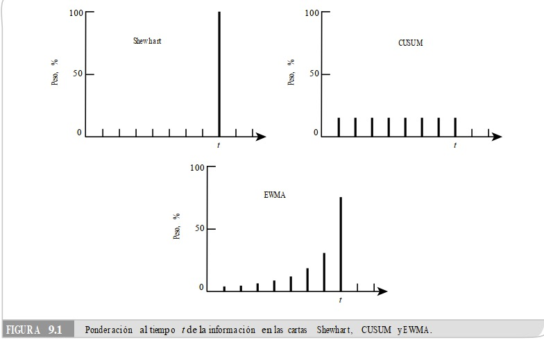

# Introducción

Una desventaja de las gráficos (cartas) de control que hemos estudiado hasta el momento, es que no son rápidas para detectar "cambios pequeños" en el proceso, donde un cambio pequeño en el proceso, donde un cambio de nivel se considera pequeño si es inferior a $1.5$ veces la desviación estándar de la medio o $<1.5\sigma_{\bar X}$. Por ejemplo, la carta de medias que es interpretada sólo con la regla 1 (un punto fuera de los límites) tardaría $43.89$ puntos en promedio en detectar un cambio de magnitud 1. Se tardaría $71.5$ puntos en promedio en detectar un cambio de magnitud $0.8\sigma_{\bar X}$. Este desempeño de la carta tradicional es lento en comparación con las cartas que emplearemos en esta sección, la cuales son capaces de detectar cambios de magnitud entre $0.8\sigma_{\bar X}$ y $1\sigma_{\bar X}$ al menos cuatro veces más rápido.

La forma tradicional de medir la velocidad con la que una carta de control detecta un cambio es a través del ARL, que es el número de puntos que en promedio es necesario graficar en la carta para que ésta detecte un cambio dado. Bajo control estadístico, el $ARL = 1/p$, donde $p$ es igual a la probabilidad de que los puntos
caigan fuera de los límites de control, que en el caso de la carta de medias y bajo el supuesto de normalidad $p = 0.0027$, y entonces $ARL = 370.4$. De esta forma, bajo control estadístico se espera que de cada $370.4$ puntos graficados en la carta de medias uno caiga fuera de los límites de control, a pesar de que no haya ocurrido un cambio; es decir, se espera que la carta de medias envíe una falsa alarma cada 370.4 puntos en promedio. En este caso, $p = 0.0027$ es la probabilidad de error tipo I, y representa el riesgo que se asume de que un punto se salga de los límites de control sin que haya ocurrido ningún cambio en el proceso.

Por lo tanto, si en la empresa ya se aplican satisfactoriamente las cartas tradicionales pero además se desea contar con herramientas que detecten de manera más oportuna los brincos o cambios pequeños en el proceso, pero que al mismo tiempo no incrementen de forma considerable las señales falsas, las alternativas más apropiadas son las cartas CUSUM y EWMA.

Es importante señalar que en la práctica es más importante detectar los cambios grandes que los pequeños, y para la detección de los primeros la carta tradicional es mejor que la CUSUM y la EWMA. Para cambios mayores a $2.5\sigma_{\bar X}$ es mejor la carta tradicional. Por ello, en los procesos que interesa realizar un monitoreo cercano para detectar cualquier cambio de nivel se recomienda aplicar una de las parejas de cartas de control: Carta tradicional-CUSUM o Carta tradicional-EWMA. Con la primera se detectan los cambios grandes y con la segunda se detectan los cambios pequeños.

La diferencia fundamental entre estas cartas con respecto a la carta tradicional es la manera en que ponderan los datos.

```{r pressure1, echo=FALSE, fig.cap="", out.width = '85%'}

```


# Gráfico (carta) CUSUM

El gráfico de CUSUM (sumas acumuladas) controla el proceso por medio de la diferencia de las sumas acumuladas con respecto a un valor objetivo (regularmente la media). Este gráfico puede ser empleado con valores agrupados o individuales. Para cada muestra dos estadísticos son monitoreados, el llamado **coeficientes de CUSUM**: uno para la desviación positiva $C_{j}^{+}$ y otro para la desviación negativa $C_{j}^{-}$, los cuales son calculados de la siguiente manera:

\begin{equation}
C_{j}^{+} max[0,x_{j}-(\mu_{0}+K)+C_{j-1}^{+}], \nonumber
\end{equation}

\begin{equation}
C_{j}^{-} max[0,(\mu_{0}-K)-x_{j}+C_{j-1}^{-}], \nonumber
\end{equation}

\begin{equation}
C_{0}^{+} = C_{0}^{-} = 0, \nonumber
\end{equation}

donde $K$ representa la cantidad de cambio que queremos detectar en términos de errores estándar. Un valor típico para $K$ es $1$. Notar que para muestras de 
$n\geq2$ observaciones, $\bar{x}_{j}$ debería ser usado en vez de ${x}_{j}$. Para un proceso en control, los coeficientes variarán de manera aleatoria al rededor de $0$. Los límites de control del gráfico de CUSUM son fijados en $\pm H$, donde $H$ está relacionado a el número de errores estándar. Un valore típico de $H$ es 5.

**Ejemplo**: Espesor de placas de metal (continuación) gráfico CUSUM.

La siguiente código gráfica un gráfico de CUSUM empleando la configuración por defecto, verificar la documentación de la función para aprender más con respecto a personalizar los gráficos.

```{r}
library(SixSigma)
library(qcc)
aggregate(thickness ~ ushift,
data = ss.data.thickness2,
FUN = mean)
thickness2days <- ss.data.thickness2$thickness[1:24]
cusum.espesor <- cusum(data = thickness2days)
summary(cusum.espesor)
```

Notar que un señal fuera de control es detectada en un muestra de tamaño $18$. El número de puntos al mismo lado de la linea central indican cuando el cambio tiene lugar.


# Gráfico (carta) EWMA

EWMA es la sigla para Exponentially Weighted Moving Average (Medias Móviles Exponencialmente Ponderadas). Esto quiere decir que el gráfico EWMA tiene memoria, como cada valor monitoriado toma en consideración la información de monitoreados previamente. Es especialmente apropiado cuando los datos se desvían significativamente de la distribución normal. La estadística para ser monitoreada es un promedio móvil ponderado $z_{j}$ calculado como:

\begin{equation}
z_{j} = \lambda x_{j} + (1-\lambda)z_{j-1}; z_{0} = \bar{\bar{x}}.  \nonumber
\end{equation}

La linea central está en $\bar{\bar{x}}$ y los límites de control son:

\begin{equation}
UCL =  \bar{\bar{x}} + L\sigma \sqrt{\frac{\lambda}{2-\lambda[1-(1-\lambda)^{2j}]}}, \nonumber
\end{equation}

\begin{equation}
UCL =  \mu_{0} - L\sigma \sqrt{\frac{\lambda}{2-\lambda[1-(1-\lambda)^{2j}]}}. \nonumber
\end{equation}

Por lo tanto, necesitamos dos parámetros para diseñar un gráfico EWMA: el parámetro de suavizado $\lambda$ y el número de sigma $L$ para determinar la anchura de los límites de control. Los valores típicos para estos parámetros son $0.2$ y $3$, respectivamente.

**Ejemplo**: Espesor de placas de metal (continuación) gráfico EWMA.

La siguiente código gráfica un gráfico EWMA empleando la configuración por defecto, verificar la documentación de la función para aprender más con respecto a personalizar los gráficos.

```{r}
ewma.espesor <- ewma(data = thickness2days)
summary(ewma.espesor)
```

Notar que en adición a los puntos y las lineas del estadístico $z_{j}$, el valor real de cada muestra u observación es trazado como un simbolo "$+$".

Finalmente, es importante destacar que los gráficos CUSUM y EWMA deberían ser considerados cuando aparecen señales que indican un situación fuera de control.

