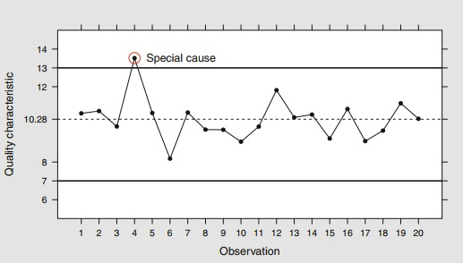
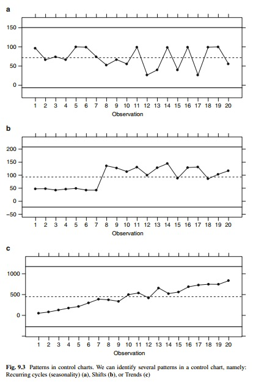
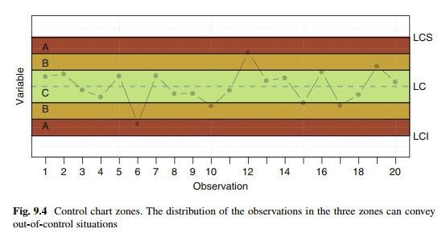

# Introducción a los gráficos de control

Los gráficos de control constituyen una herramienta básica en los procesos de control de calidad estadístico. Esta subunidad desarrolla los fundamentos de muchos de los gráficos de control aplicados comunmente. Aunque la idea general de los gráficos de control son comunes, dos grades diferencias son consideradas: gráficos de control por variables, donde las características las características son continuas; y gráficos de control por atributos, donde las variables monitoreadas son discretas.

La idea subyacente de los gráficos de control es construir limites naturales para una estadística de resumen dada de una característica bajo estudio. Bajo la presencia de causas comunes (naturales) de variación, este estadística resumen se espera permanezca dentro de estos límites. Sin embargo, si la estadística se encuentra fuera de los límites naturales, es muy probable que solamente la variabilidad natural este presente, y una investigación debería ser llevada acabo en orden para asignar posibles causas de variación, las cuales deberían ser eliminadas. En la practica, los límites naturales deberían ser estimados acorde a una distribución muestral de la estadística que es monitoreada, y la nos referiremos a los límites estimados como **límites de control**.

## Elemtos de un gráfico de control

1. Linea central (CL): este es el valor central alrededor del cual debería variar la estadística bajo monitoreo.

2. Límite de control inferior (LCL): este el el valor inferior, el cual en muy improbable que la estadística ocurra cuando el proceso está bajo control.

3. Límite de control superior (UCL): este es la contrapartida de LCL en la parte superior de la CL. El LCL y UCL son simétricos si la distribución de probabilidad del estadístico bajo monitoreo es simétrico (ejemplo normal)


## Diseño de un gráfico de control

¿Cómo establecer los límites de control? 

i. son estimados empleando una muestra preliminar, muestra de tamaño 25-30.

ii. muestras subsecuentes son graficadas empleando los anteriores límites.

Cuando las observaciones individuales de la estadística que está siendo monitoreada se encuentran entre los limites de control, el proceso es considerado **estar estadísticamente en control**.

Podriamos estar interesados en decidir la frecuencia del muestreo. Para ello empleamos la Longitud Media de Muestreo (Average Run Lenght-ARL), el número de muestra, en promedio, que serán obtenidas antes de detectar un cambio en el proceso. Su parámetro $p$ es la probabilidad de que un punto se encuentre fuera de los límites de control. la media de $\mu = 1/p$.

\begin{equation} 
ARL = \frac{1}{p} = \frac{1}{0.0027} = 370.37. \nonumber
\end{equation}


## Leer un gráfico de control

El proceso de variación natural es debido a causas comunes, mientras la variación fuera de los limites de control es debido a causas especiales. El surgimiento de las causas comunes provienes de la aleatoriedad y todo lo que podemos hacer es tratar de reducirlas en orden de mejorar el proceso, por ejemplo a través de Diseño de Experimentos. Una causa especial lleva a una variabilidad que no es una consecuencia de la aleatoriedad. Entonces, cuando un punto se encuentra por fuera de los límites de control, la causa (especial) debería ser identificada, analizada y erradicada.


```{r pressure, echo=FALSE, fig.cap="", out.width = '85%'}

```

Las causes especiales pueden ser generadas por otros problemas en un proceso. Ellos pueden ser identificados a través de los patrones en el gráfico.

```{r pressure2, echo=FALSE, fig.cap="", out.width = '75%'}

```

Las siguientes señales pueden ayudar a identificar las situaciones fuera de control anteriores:

i. Puntos fuera de los limites de control.

ii. Siete puntos consecutivos en el mismo lado de la linea central.

iii. Seis puntos consecutivos incrementando o disminuyendo.

iv. 14 puntos consecutivos alternando de arriba a abajo.

v. Cual otro patrón inusual.


Otros patrones inusuales que pueden surgir basados en el gráfico 9.4 son:

1. Dos de tres consecutivos puntos en la Zona A o por encima.

2. Cuatro de cinco puntos consecutivos en la Zona B o por encima.

3. Quince puntos consecutivos en la Zona B.

```{r pressure3, echo=FALSE, fig.cap="", out.width = '85%'}

```


## Gráfico de control por variables

Cuando las características bajo medición es una variable numérica continua deberíamos utilizar gráficos de control por variables. En este tipo de proceso de control tenemos que controlar tanto los valores centrales de la variables y su variabilidad, esta es la razón por la cual los gráficos de control por variables empleados dos por dos: un gráfico para los valores centrales y otro para la variabilidad.

### Estimación de $\sigma$ para los gráficos de control

La desviación estándar no es un estimador insesgado de la desviación poblacional. Por lo tanto, en estadística de control de procesos, los siguientes estimadores sin usualmente empleados: $\frac{s}{c4}$ o $\frac{R}{d2}$. Los coeficientes $c4$ y $d2$ pueden ser encontrados en la pagina 285. Ellos pueden ser calculados en $R$ usando las funciones ss.cc.getc4 y  ss.cc.getd2 en el paquete SixSigma.


### Gráficos de control por datos agrupados

En orden para construir este tipo de gráficos nosotros tenemos que definir subgrupos raciones, idealmente de igual tamaño. Si los grupos tiene tamaños diferentes, entonces los límites de control no serán constantes, y tendrá una aspecto desigual que los hará más difícil para la interpretación.

El más famoso par de gráficos de control es el gráfico de media y rango o gráfico X-R.  

### Gráfico de media (gráfico de X barra)

La estadística para ser estimada es la media de cada muestra $\bar x_{j}$:

\begin{equation}
\bar x_{j} = \frac{\sum_{i=1}^{n}x_{ij}}{n_{j}}, \quad j=1,....,m \nonumber
\end{equation}

La linea central (CL) es llamada la gran media $\bar{\bar{x}}$, ejemplo:

\begin{equation}
\bar{\bar{x}} = \frac{\sum_{i=1}^{n}{\bar{x}_{j}}}{m}. \nonumber
\end{equation}

Para calcular los límites de control ($CL\frac{+}{-}3\sigma$) necesitamos estimar $\sigma$. En este caso, como estamos monitoreando las medias, necesitamos la desviación estándar de aquellas medias en orden para calcular los limites. Desde la distribución muestral de las media muestral, nosotros sabemos que su desviación estándar es $\frac{\sigma}{\sqrt{n}}$. Entonces tenemos:

\begin{equation}
\bar{\bar{x}} 
\end{equation}

\begin{equation}
UCL = \bar{\bar{x}} + \bar{R} \times \frac{3}{d2\sqrt{n}}  \nonumber
\end{equation}

\begin{equation}
LCL = \bar{\bar{x}} - \bar{R} \times \frac{3}{d2\sqrt{n}}  \nonumber
\end{equation}

donde $\bar{R}$ es el rango promedio 

\begin{equation}
\bar{R} = \frac{\sum_{j=1}^{m}R_{j}}{m}; \quad maxx_{ij}- minx_{ij}, \nonumber
\end{equation}

donde $d2$ es una constante que solamente depende de $n$.


**Ejemplo**. Espesor de placas de metal. Gráfico X-bar.
Tenemos que medir el espesor de las placas de metal provenientes de $m=14$ muestras de tamaño $n=6$, correspondientes a 7 días, una muestra para cada uno de los turno en los cuales se organiza la producción. El data frame ss.data.thickness2 está en el paquete SixSigma


```{r}
# install.packages("SixSigma") instalar una sola vez
# install.packages("qcc") instalar una sola vez
library(SixSigma)
library(qcc)
aggregate(thickness ~ ushift,
data = ss.data.thickness2,
FUN = mean)

samples.thick <- qcc.groups(
data = ss.data.thickness2$thickness,
sample = ss.data.thickness2$ushift) # convertimos nuestros datos en un data frame
samples.thick
```


Ahora creamos un objeto qcc para un gráfico X-bar:

```{r}
xbar.thick <- qcc(data = samples.thick, type = "xbar")
summary(xbar.thick) # estadísticas de resumen y gráfico de control
```


```{r}
plot(xbar.thick) # solamente obtener gráfico de control
names(xbar.thick)
```


Por otra parte, la función qcc.options nos permite modificar algunas opciones general de nuestro gráfico 

```{r}
qcc.options("beyond.limits" = list(pch = 20,
col = "red3"))
qcc.options(bg.margin = "azure2")
plot(xbar.thick,
axes.las = 1,
digits = 3,
title = "X-Bar Espesor placas de metal",
xlab = "Cambio",
ylab = "Media muestral",
ylim = c(0.70, 0.80))
```


Calculo de ARL

```{r}
thick.betas <- oc.curves(xbar.thick)
1/(1 - thick.betas[rownames(thick.betas) == "1", 1])
```


### Gráfico de rango (R-gráfico)

Este gráfico monitorea la estabilidad de la variabilidad del proceso por medio de los rangos muestrales. Entonces, la estadística es el rango, y los límites de control son:

\begin{equation}
CL =  \bar{R} 
\end{equation}

\begin{equation}
UCL =  \bar{R} + 3 \times \bar{R} \frac{d3}{d2}  \nonumber
\end{equation}

\begin{equation}
LCL = \bar{R} - 3 \times \bar{R} \frac{d3}{d2}  \nonumber
\end{equation}

En este caso, estimamos $\sigma_{R}$ como $d3\frac{\bar{R}}{d2}$. Regularmente las formulas son simplificadas como:

\begin{equation}
UCL =  \bar{R} \times D4 \nonumber
\end{equation}

\begin{equation}
LCL = \bar{R} \times D3  \nonumber
\end{equation}

donde: $D4 = 1+ \frac{3d3}{d2}$ y $D3 = 1- \frac{3d3}{d2}$

**Ejemplo**. Espesor placas de metal (continuación).  Como ya tenemos una matriz con la muestra en el objeto sample.thich, podemos crear el siguiente gráfico de control


```{r}
r.thick <- qcc(data = samples.thick, type = "R")
```

Aparentemente, aunque detectamos muestras por fuera de la media, el proceso está bajo control. 


