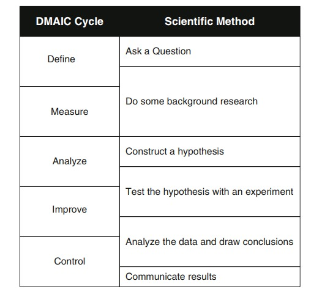
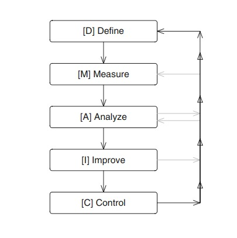
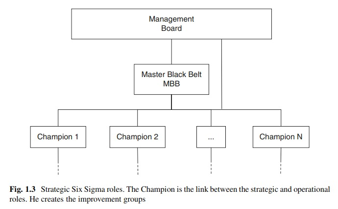
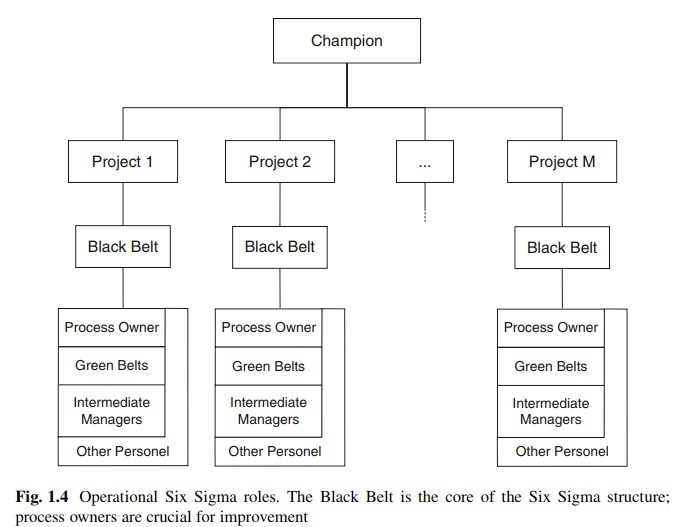

# Introducción

Muchas metodologías de la administración total de la calidad han sido introducidas en los últimos años, y **Six Sigma** ha emergido como una metodología innovadora. Esencialmente, la metodología Six Sigma es un paradigma de calidad que traduce la metodología cientifica en una manera simple para aplicar la metodología cientifica en las organizaciones. De hecho, de acuerdo a la Organización Internacional para la Estandarización (ISO), "la metodología Six Sigma habla el lenguage de los negocios".

# Breve historia

El inicio de la metodología Six Sigma se remonta a los mediados de la decada de los ochenta. En ese tiempo, Mikel Harry, conocido como el padre de Six Sigma, estuvo trabajando para Motorola. Junto con Bill Smith, desarrolló una metodología para la solución de problemas siguiendo una aproximación disciplinar. Basado en esta metodología, el 15 de Junio de 1987, Motorola lanzó un programa de calidad llamado "The Six Sigma Quality Program".

Pero la metodología alcanza su mayor éxito a mediados de los noven, cuando Jack Welch, Jefe y CEO de General Electric, adoptó la metodología como una estrategia de negocio para esa compañía. Fue así como Six Sigma llego a ser una filosofía de la administración basada en la toma de decisiones científicas.

# ¿Qué es Six Sigma?

La metodología Six Sigma consiste en la aplicación del método científico a los proceso de mejora. A su vez, entendemos que un proceso puede ser referido como un grupo de acciones interdependiente directamente dirigidas a alcanzar algún objetivo o fin. Estas acciones pueden corresponder a pequeños procesos. Six Sigma puede ser también empleada para la creación de nuevos procesos. En este caso, debido a que no hay procesos para ser medidos, un conjunto de herramientas conocidas como "Diseño para Six Sigma" pueden ser empleadas.

Entonces, cuando empleamos Six Sigma para la mejora o creación de un nuevo proceso, estamos aplicando el método científico para obtener procesos de alta calidad. La razón para esto es clara: procesos de alta calidad automáticamente llevan a resultados de alta calidad, usualmente referenciados como productos.

La metodología Six Sigma se reduce a un ciclo de cinco pasos: definir, medir, analizar, mejorar y controlar también conocido como el ciclo **DMAIC** (por sus siglas en inglés).

¿Qué es lo nuevo que aporta SIX Sigma? La respuesta es simple: Six Sigma traduce el lenguage científico a una manera entendible para aplicar el método científico en una organización. Esta es la clave del éxito de para Six Sigma.

# Ciclo DMAIC

cuando Six Sigma es implementada, debería ser aplicada sobre un proyecto bien definido. Una vez el proyecto o los proyectos han sido elegidos, la estrategia para resolverlos sigue el mencionado ciclo DMAIC.

## Fase de definición

Con la fase de definición, comienza el viaje al problema en cuestión. Inicialmente debería ser determinado si la metodología Six Sigma es adecuada para solución del problema. La entrega clave para esta fase del ciclo DMAIC es el capitulo del proyecto. Un capitulo del proyecto es una declaración de las metas, objetivos y los participantes del proyecto. Esto provee una delineación de los roles y responsabilidad, describe los objetivos, identifica los principales actores involucrados y define la autoridad del proyecto.

## Fase de medir

Es la segunda fase de DMAIC, El objetivo de esta fase es recoger desde el proceso actual tanta información como sea posible. Debería ser adecuado determinar como operan los procesos.

La tareas claves en esta fase son la creación de un mapa de procesos detallado, la colección de un linea base de datos y, finalmente, resumir los datos recogidos.

El mapa de procesos provee una representación visual de los procesos bajo investigación. 

## Fase de análisis

Es la tercera fase del proceso DMAIC, donde el equipo establece las causas fundamentales del problema bajo estudio. Diferente con otras estrategias más simple en la resolución de problemas, en la metodología Six Sigma las causas fundamentales deberían ser validadas por los datos, llevando a que conocemos como "decisiones basadas en hechos."

El mapa de procesos, los datos colectados y algún otro cumulo de conocimiento durante las fases de definición y medición deberían empleados para determinar las causas fundamentales.

Aplicación de análisis estadístico.

## Fase de mejora

El objetivo de esta fase es determinar una solución al problema en cuestión. Lluvia de ideas es comunmente utilizada para generar un conjunto de potenciales soluciones. Es importante en esta fase contemplar personas que desempeñarán un proceso proceso regular en el proyecto.

Priori a la implementación, el equipo debería estar seguro que la solución propuesta realmente funciona. Programas pilotos, simulación por computadores e implementación segmentada son todas las posibilidad en este punto.

## Fase de control

Es la fase final; su objetivo, simplemente, es asegurar los beneficios que fueron logrados como resultado de la fase de mejora. La idea de control en Six Sigma difiere de las operaciones tradicionales. 

```{r pressure1, echo=FALSE, fig.cap="Relación entre el ciclo DMAIC y el método científico.", out.width = '85%'}

```

```{r pressure2, echo=FALSE, fig.cap="Mapa de ruta del ciclo DMAIC. Interacción entre las fases del ciclo.", out.width = '85%'}

```


# Estructura operaciones del Six Sigma

Six Sigma no requiere cambios especiales en la estructura jerárquica de una organización; solamente requiere ajustes. La estructura típica de trabajo de Six Sigma está dada por los siguientes roles: campeón, maestro de cinturón negro (MBB), cinturón negro (BB), dueño del proceso y cinturón verde (GB). Esta terminología tiene sus orígenes en el interés de Mikel Harry por las artes marciales.

```{r pressure3, echo=FALSE, fig.cap="", out.width = '85%'}

```

```{r pressure4, echo=FALSE, fig.cap="", out.width = '85%'}

```


