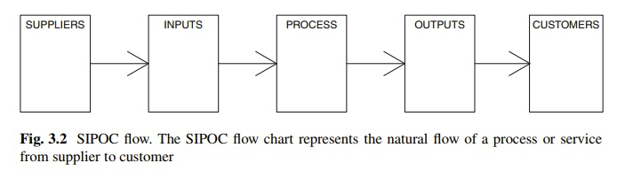

# Introducción

En esta sección abordamos la **fase de definición** y las herramientas utilizadas en esta fase.

El ciclo DMAIC inicia con la fase de definición después de haber identificado el problema a resolver. El objetivo de la fase de definición es definir los objetivos del proyecto y entregables. Incluye desarrollar un árbol de problemas e identificar objetivos, recursos e hitos del proyecto.

Dos principales herramientas en la fase de definición son:

- Mapa de procesos.

- Análisis de función de perdida.

# Mapa de procesos

Como su nombre lo indica, el mapa de procesos es mapear procesos. Es una representación visual del flujo de procesos o trabajo. Muestra la serie o secuencia de eventos desde el inicio hasta el fin, por ejemplo desde la materia prima hasta el producto final. El mapa de procesos ayuda de la siguiente manera:

- Mejora el entendimiento de los procesos, a su vez ayuda en la mejora de la eficiencia de los procesos.

- Efectividad en la lluvia de ideas para la mejora de los procesos. 

- Mejora en la documentación de los procesos y la planificación del proyecto.

- Mejora la comunicación entre los miembros del equipo de trabajo en un mismo proyecto.

En un proyecto Six Sigma, podemos tener diferentes mapas de procesos, por ejemplo en la fase de definición se trabaja sobre un *mapa de nivel superior* ("as is"), mientras en la fase de mejora se tiene un *mapa de procesos final*. El *mapa de procesos final* debería ser similar al *mapa de estado ideal* ("to be") desarrollado en la fase de mejora. En general, hay dos tipos de mapas en los proyectos Six Sigma: SIPOC y VSM.

- SIPOC (por sus siglas en inglés) significa Proveedor, Entrada, Proceso, Salida, Cliente (desde el proveedor a cliente)

- VSM (por sus siglas en inglés) significa mapa de flujo de valor. No solo muestra el flujo del proceso, sino que también muestra qué paso está agregando valor al proceso y cuál es un cuello de botella.

En este proceso, pasaremos por una estrategia simple de mapeo de procesos de 2 etapas que es común para todos los tipos. El mapa del proceso, en general, se construye en 2 pasos generales:

- Definir mapa de nivel superior.
- Divide el proceso en pasos más simples.

```{r pressure1, echo=FALSE, fig.cap="", out.width = '85%'}

```

## Paso a paso en la creación de un mapa de procesos

- Identificación de entradas y salidas: las entradas (insumos) son las X de un proceso y la salida (resultado final) es la Y del proceso (también llamado CTQ,  características de calidad crítica de un producto)

- Listado de los pasos del proyecto: enumerar los pasos del proyecto, como mecanizado, acabado, inspección.

- Identificación de las salidas de cada paso: cada proceso crea una salida, que se ingresará para el siguiente proceso secuencial. Por lo tanto, puede ser un producto en proceso o un producto final.

- Identificación de los parámetros de cada paso: identificar y enumerar los parámetros que afectan el proceso en un paso específico. Esa es la X de ese paso y afectan la salida o las características de la salida.

- Clasificación de los parámetros: después de identificar los parámetros, clasifícarlos de la siguiente manera:

1. Ruido N: factores no controlables
2. C Factores controlables: pueden variar durante el proceso
3. Procedimiento P: factores controlables a través de un procedimiento estándar
4. Cr critico: Aquellos con más influencia en el proceso.


Usamos el paquete SixSigma para crear un mapa de proceso en R. Vamos a crear un mapa de proceso para hacer y servir Pizza. El proceso se puede dividir en 4 pasos:

- Prepara la masa
- Extender los ingredientes.
- Hornea la pizza.
- Entregar la pizza al cliente.

Ahora enumerar los parámetros y la salida en cada paso.

- Primer paso: Masa: Parámetros: cocinar (C), una marca de harina (C), la proporción de agua (P). Salidas: masa (densidad, dureza y grosor).
- Segundo paso: Ingredientes: Parámetros: cocinar (C), una marca de ingredientes (Cr), cantidad de ingredientes (P), tiempo de preparación (Cr). Salidas: pizza cruda (diámetro, peso, grosor).
- Tercer paso: horneado: parámetros: cocción (C), cola (N), tiempo de cocción (Cr). Salidas: pizza horneada (temperatura, textura, sabor).
- Cuarto paso: Entrega: Parámetros: camarero (C), cola (N). Salidas: pizza sobre la mesa (temperatura, sabor, textura, peso, radio, tiempo).

Ahora, sabemos que cada proceso tiene alguna entrada / salida y algunos parámetros involucrados en cada proceso. Los datos aquí son datos de cadena de caracteres que representan los nombres de entrada, proceso, parámetros y salida. Entrada / Salida se representa como cadenas de vectores. La salida de un proceso se ingresa al siguiente proceso.

Creemos un mapa de proceso de muestra para una empresa de fabricación de pistones. Hay cuatro procesos: forja, mecanizado, acabado y ensamblaje.

```{r, fig.width=7, fig.height=6}
#Cargar package
library("SixSigma")
# Crear un vector de Insumo, Salida y Pasos 
insumos <-c ("Ingredientes", "Cocina", "Hornor", "Platos")
salidas <- c("Temperatura", "sabor", "textura","peso", "radio", "tiempo")
pasos <- c("Masa", "Ingredientes", "Hornear", "Entrega")

# Guardar el nombre de los insumos (entradas) en cada paso en la lista
io <- list()
io[[1]] <- list("Las Xs")
io[[2]] <- list("Masa", "ingredientes", "Horno")
io[[3]] <- list("Pizza cruda", "Horno", "Bandeja de hormo")
io[[4]] <- list("Pizza al horno", "Plato")

#Guardar el nombre, tipos de parámetros y caracteristicas:
param <- list()
param[[1]] <- list(c("Cocinar", "C"),c("Marca de harina", "C"),c("prop agua", "P"))
param[[2]] <- list(c("Cocinar", "C"),c("Marca ingred", "Cr"),c("Cantidad", "P"),c("T preparación", "Cr"))
param[[3]] <- list(c("Cocinar","C"),c("cola", "N"),c("Tiempo hornear", "Cr"))
param[[4]] <- list(c("Camarero","C"),c("cola", "N"))

feat <- list()
feat[[1]] <- list("Densidad", "dureza", "grosor")
feat[[2]] <- list("diametro", "peso", "grosor")
feat[[3]] <- list("temperatura", "textura", "taste")
feat[[4]] <- list("temperatura", "sabor", "textura","peso", "tiempo")
# Crear mapa de procesos
ss.pMap(pasos, insumos, salidas,io, param, feat,sub = "Elaboración Pizza")
```


El mapeo de procesos es una herramienta muy importante en la fase de definición del ciclo DMAIC. La fuente para su construcción es la Carta del Proyecto, y consiste en describir los pasos que conllevan un proceso y la identificación de entradas, salidas, parámetros y características. La relación entre los parámetros y las características del proceso será el hilo principal en las fases posteriores de un proyecto Six Sigma. Por lo tanto, recopilar esta información no es un asunto menor.


# Análisis de la función de pérdida

Dado que solo hay unas pocas características de un producto que son críticas para la calidad (Critical to Quality-CTQ) o importantes para el cliente. Entonces, para cumplir con las expectativas del cliente, el proceso debe ser correcto. En el lenguaje profesional Six Sigma: los procesos de alta calidad conducen automáticamente a productos de alta calidad. El costo de la mala calidad dará como resultado una pérdida cuantificable para la organización. Esta pérdida puede ser modelada por una función. Se llama **función de pérdida de calidad** introducida por Taguchi, para calcular la pérdida promedio de un proceso. Cuando la característica CTQ se encuentra fuera de los límites de especificación, es decir, la calidad es deficiente, la empresa incurre en un costo que obviamente debe calcularse.

## Modelando la función de pérdida

Notación: La característica CTQ estará representada por $Y$. La función de pérdida proporcionará un número que indica el valor del costo en unidades monetarias. Este costo depende directamente del valor del CTQ. Entonces, $\textbf{loss}$ es una función del valor observado y lo representa por $L(Y)$. Para cada valor de la característica CTQ, solo tenemos un valor de la pérdida (costo).

El valor objetivo de la característica CTQ es denotado por $Y_{0}$ y la tolerancia por $\Delta$. Sea el costo de un pobre calidad en $Y = Y_{0} + \Delta$ de $L_{0}$. Entonces $L_{0} = L(Y_{0} + \Delta)$.

## Función de pérdida de Taguchi

No es suficiente tener una característica CTQ dentro de los límites de especificación. En la forma Six Sigma, debe aproximarse al objetivo con la menor variación posible. Entonces la función de pérdida debe estar relacionada con la distancia desde el objetivo.

La función de pérdida definida como: $L(Y) = k(Y-Y_{0})^{2}$

Esta función tiene las siguientes propiedades:

- $\textbf{loss=0}$, cuando el valor observado es igual al objetivo.
- La pérdida aumenta cuando el valor observado se aleja del objetivo.
- La constante $k$ es indicativa del riesgo de tener más variación.

**Ejemplo**

Una fábrica hace tornillos cuya característica CTQ es el diámetro de los tornillos. Suponga que el Master Black Belt (Maestro de Cinturón negro) desea evaluar el proceso de fabricación de pernos de 10 mm. Se conocen los siguientes datos:

- El cliente aceptará los pernos si el diámetro está entre 9.5 y 10.5 mm.
- Cuando un tornillo no cumple con los requisitos, se descarta y la estimación de costo es de $0.001$ unidades monetarias.

Entonces el objetivo es 

\begin{equation}
Y_{0} = 10, \nonumber
\end{equation}

la tolerancia del proceso es:

\begin{equation}
\Delta = 0.5mm, \nonumber
\end{equation}

y el costo en $Y_{0} + \Delta$ es

\begin{equation}
L_{0} = L(Y_{0} + \Delta) = 0.001. \nonumber
\end{equation}

El valor de $k$ puede ser calculado desde la formula de la función de pérdida:

\begin{equation}
L(Y) = k(Y-Y_{0})^{2}, \nonumber
\end{equation}

\begin{equation}
\begin{split}
L(Y) & = k(Y-Y_{0})^{2}, \\ 
L(Y_{0} + \Delta) & = k((Y_{0}+\Delta)-Y_{0}) = L_{0}, \\
K \times \Delta & = L_{0}, \\
K & = \frac{L_{0}}{\Delta}. \nonumber
\end{split}
\end{equation}

Esta formula siempre es la misma. Por lo tanto, podemos modelar la función de pérdida conociendo la tolerancia ($\Delta$) y el costo de una pobre calidad de un objetivo individual ($L_{0}$).

En el caso en cuestión, $k$ es igual a 

```{r}
0.001/0.5
```

Entonces la función de pérdida para el proceso de elaboración de tornillos es

\begin{equation}
L(Y) = 0.002(Y-10)^{2}, \nonumber
\end{equation}

y podemos gráficar la función en R con la siguientes linea de código:

```{r}
curve(0.002 * (x - 10)^2, 9, 11,
lty = 1,
lwd = 2,
ylab = "Cost of Poor Quality",
xlab = "Observed value of the characteristic",
main = expression(L(Y) == 0.002 ~ (Y - 10)^2))
abline(v = 9.5, lty = 2)
abline(v = 10.5, lty = 2)
abline(v = 10, lty = 2)
abline(h = 0)
text(10, 0.002, "T", adj = 2)
text(9.5, 0.002, "LSL", adj = 1)
text(10.5, 0.002, "USL", adj = -0.1)
```

La gráfica anterior demuestra que el valor objetivo y la parte inferior de la función parabólica se cruzan, lo que implica que a medida que las partes se producen al valor nominal, se produce poca o ninguna pérdida. Además, la curva se aplana a medida que se acerca y se aleja del valor objetivo.

En el ejemplo anterior, creamos la función de pérdida de calidad para un solo artículo. Sin embargo, el objetivo del análisis de la función de pérdida es calcular el costo de mala calidad para un proceso durante un período de tiempo. Por lo tanto, si tenemos n elementos en un período o conjunto de elementos, la pérdida promedio por unidad L se obtiene promediando las pérdidas individuales.

\begin{equation}
L = \frac{\sum_{i=0}^{n}k(Y_{i}-Y_{0})^{2}}{n} = k\frac{\sum_{i=0}^{n}(Y_{i}-Y_{0})^{2}}{n}. \nonumber
\end{equation}

El segundo factor es la media de la desviación al cuadrado (MSD). Por lo tanto, la pérdida promedio por unidad en una muestra dad es simplemente expresada por $L = k(MSD)$.

Creamos ka función de pérdida de calidad para el proceso en R empleando la muestra de datos de tornillos

```{r}
library(SixSigma)
# Creamos una función de pérdida con Tolerancia=0.5 ,objetivo=10, 
# Costo por pobre calidad=0.001,tamaño del lote=100,000)
 ss.lfa(ss.data.bolts, "diameter", 0.5, 10, 0.001,lfa.sub = "Bolts example loss function",
lfa.size = 100000, lfa.output = "both")
```


