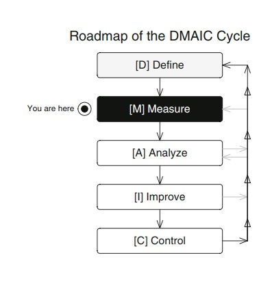
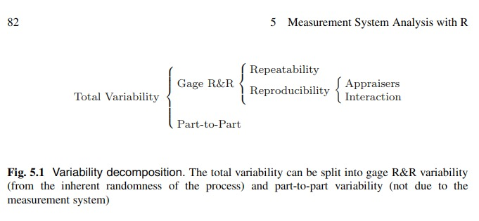

```{r pressure1, echo=FALSE, fig.cap="", out.width = '85%'}

```

# Introducción

Un análisis del sistema de medición (MSA por sus siglas en inglés), también conocido como estudio de Calibre R&R del sistema de medición, identifica y cuantifica las fuentes de variación que influyen en el sistema de medición. R&R es sinónimo de repetibilidad y reproducibilidad. Es un asunto muy importante en Six Sigma porque si la variabilidad del sistema de medición no se controla, entonces el proceso no se puede mejorar. Para realizar un estudio R&R del sistema de medición, se pueden utilizar gráficos de control, análisis de varianza (ANOVA) y gráficos.

## Definición

El MSA, también conocido como estudio de medición y control R&R, es una evaluación exhaustiva de un proceso de medición, y generalmente incluye un experimento especialmente diseñado que busca identificar los componentes de variación en ese proceso de medición. El estudio de Calibre R&R cuantifica tres cosas:

1. Repetibilidad: variación del instrumento de medición.
2. Reproducibilidad: variación de los individuos que usan el instrumento.
3. Estudio de Calibre R&R general, que es el efecto combinado de (1) y (2).

El estudio de Calibre R&R general normalmente se expresa como un porcentaje de la tolerancia para el CTQ que se está estudiando, y un valor de $10\%$ de R&R o menos se considera aceptable en la mayoría de los casos.

Hay otros 3 conceptos que deben entenderse:

- Exactitud: qué tan cerca está el resultado de su prueba del valor de referencia aceptado.
- Verdad: qué tan cerca está su valor promedio obtenido de una gran serie de resultados de prueba y un valor de referencia aceptado.
- Precisión: cuán precisos son los resultados de sus pruebas independientes obtenidos en condiciones estipuladas.

# Análisis de datos

## Colección de datos

Como en toda investigación estadística, la aleatorización es muy importante en Six Sigma. Por lo tanto, debemos seleccionar aleatoriamente las partes (prototipo, pieza, elementos mecánicos, actividades de servicio) y asignarlas a los tasadores (máquinas, medidores, operadores, etc.) nuevamente.

En lo que sigue, consideraremos $n$ medidas de cada parte $(n \geq 2)$ dentro de cada evaluador. Sea $a$ y $b$ el número de partes y el número de evaluadores, respectivamente. Permítanos guardar los datos como un data frame con una variable numérica (la característica a medir) y dos factores (partes y tasadores). Por lo tanto, tenemos $n \times a \times b$ observaciones

**Ejemplo**. Voltaje de baterías. Un fabricante de baterías fabrica varios tipos de baterías para uso doméstico. El Master Black de la compañía debe comenzar un proyecto Six Sigma para mejorar la línea de producción de baterías de $1.5$ voltios. Identificó la salida de voltaje como la característica CTQ en la fase de Definición. Ahora se debe evaluar el sistema de medición antes de comenzar otros análisis.

Hay dos voltímetros disponibles, y tres baterías diferentes se recogen al azar desde el final de la línea de producción. El voltaje en cada batería se mide con cada voltímetro tres veces. Los resultados se enumeran en la de abajo.

En este ejemplo, las partes son las baterías $(a = 3)$ y los evaluadores son los voltímetros (b = 2). Como la medición se toma tres veces $(n = 3)$, hay $3 \times 2 \times 3 = 18$ mediciones. Permítanos guardar los datos en un marco de datos utilizando los siguientes comandos:

```{r}
voltimetro <- factor(rep(1:2, each = 9))
baterias <- factor(rep(rep(1:3, each = 3), 2))
run <- factor(rep(1:3, 6))
voltaje <- c(1.4727, 1.4206, 1.4754, 1.5083, 1.5739,
1.4341, 1.5517, 1.5483, 1.4614, 1.3337,
1.6078, 1.4767, 1.4066, 1.5951, 1.8419,
1.7087, 1.8259, 1.5444)
baterias <- data.frame(voltimetro, baterias, run, voltaje)
baterias
```


```{r pressure2, echo=FALSE, fig.cap="", out.width = '85%'}

```


## Análsis de varianza

Como ya se mencionó, el punto clave es la identificación de las fuentes de variabilidad dentro del sistema de medición. La técnica estadística conocida como análisis de varianza (ANOVA) nos permite descubrir quién es responsable de esa variación.

**Ejemplo**. Voltaje de baterías (continuación). Con las siguientes lineas de comandos podemos obtener una tabla ANOVA para las mediciones de las baterías:

```{r}
anova(lm(voltaje ~ baterias + voltimetro +
baterias * voltimetro,
data = baterias))
```

La repetibilidad se puede obtener directamente de la tabla como el cuadrado medio residual. El resto de los componentes de la variabilidad total en la figura 5.1 se pueden calcular de la siguiente manera:

\begin{equation}
\sigma^{2}_{evaluador} = \frac{MSB-MSAB}{a \times n}, \nonumber
\end{equation}

\begin{equation}
\sigma^{2}_{interaccion} = \frac{MSAB-MSE}{n}, \nonumber
\end{equation}

\begin{equation}
\sigma^{2}_{reproducibilidad} = \sigma^{2}_{evaluador} + \sigma^{2}_{interaccion} , \nonumber
\end{equation}

\begin{equation}
\sigma^{2}_{RR} = \sigma^{2}_{repetibilidad} + \sigma^{2}_{reproducibilidad} , \nonumber
\end{equation}

\begin{equation}
\sigma^{2}_{parte} = \frac{MSA-MSAB}{b \times n}, \nonumber
\end{equation}

\begin{equation}
\sigma^{2}_{total} = \sigma^{2}_{RR} + \sigma^{2}_{parte}, \nonumber
\end{equation}

donde $a$ y $b$ son el número de niveles de cada factor, $n$ es el número de medidas replicadas, y MSA, MSB, MSAB y MSE corresponden respectivamente a la media de los cuadrados de $A$ y $B$, la interacción entre los factores $(AB)$, y el error Si algún componente es negativo, debe tomarse como cero

**Ejemplo**. Voltaje de baterías (continuación). La repetibilidad se puede medir directamente a partir de los cuadrados medios residuales en la tabla ANOVA (tercera columna, cuarta fila), de modo que $\sigma^{2}_{repetibilidad}$ es

```{r}
anova(lm(voltaje ~ baterias + voltimetro +
baterias * voltimetro,
data = baterias))[3][4,1]
```

La variabilidad del evaluador (en este caso, debido al voltimetro) $\sigma^{2}_{evaluador}$ es 

```{r}
(0.0444 - 0.0092) / (3*3)
```

La variabilidad debido a la interacción entre la batería y el voltimetro es $\sigma^{2}_{interaccion}$:

```{r}
(0.0092 - 0.0158) / 3
```

Esta variabilidad no debería ser negativa, y por lo tanto la asumimos como cero. Entonces la cantidad reproducibilidad $\sigma^{2}_{reproducibilidad}$

```{r}
 0.0039 + 0
```

La variación de la calibración R&R $\sigma^{2}_{RR}$ toma el valor 

```{r}
0.0158 + 0.0039
```

La variación parte por parte $\sigma^{2}_{parte}$ será

```{r}
 (0.0315 - 0.0092) / (2 * 3)
```

Finalmente, la variación total $\sigma^{2}_{total}$ es

```{r}
0.0037 + 0.0197
```


